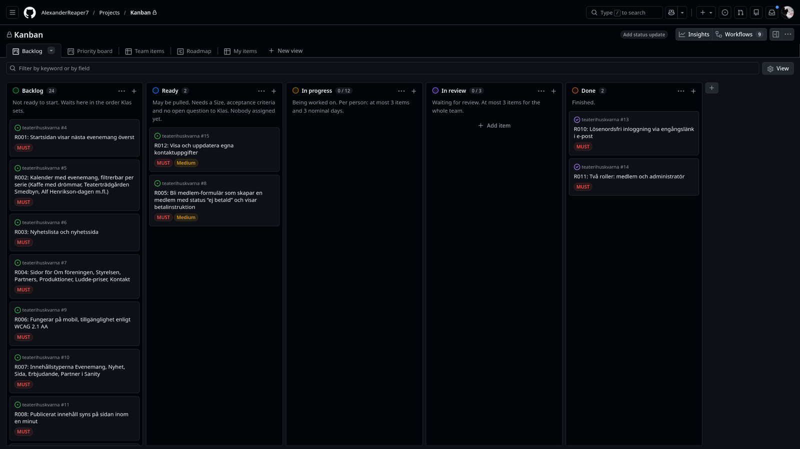
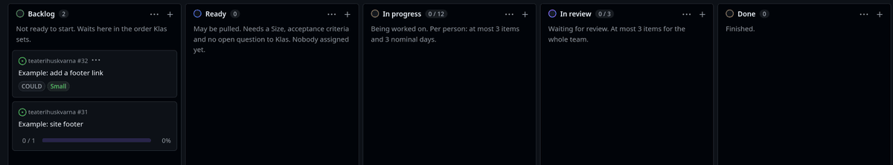
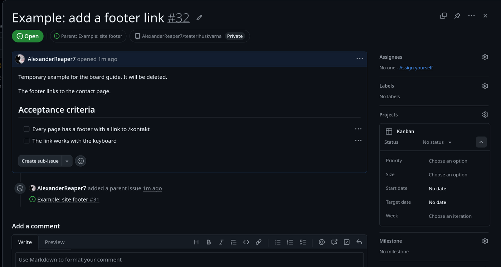
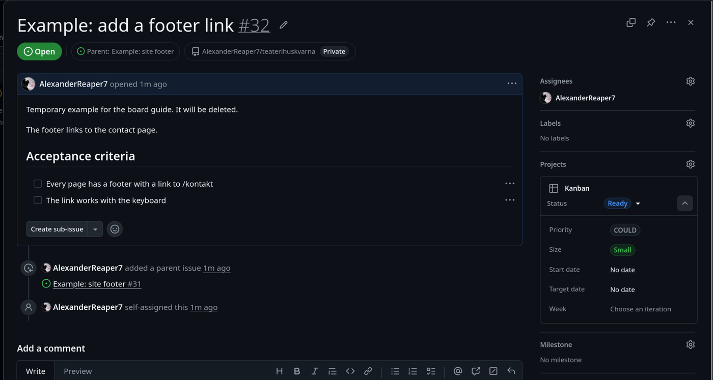
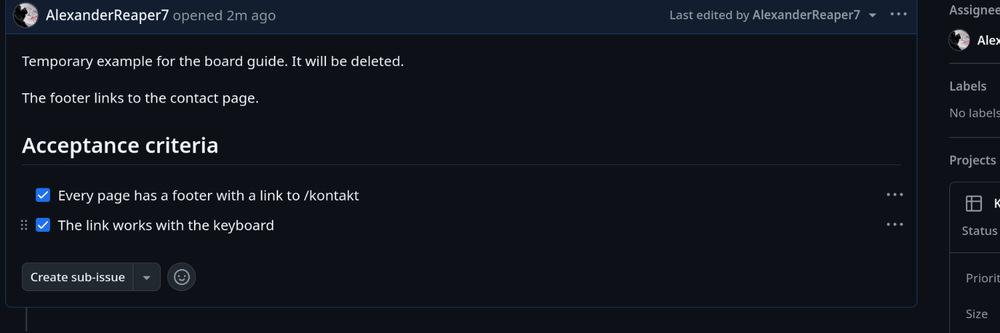
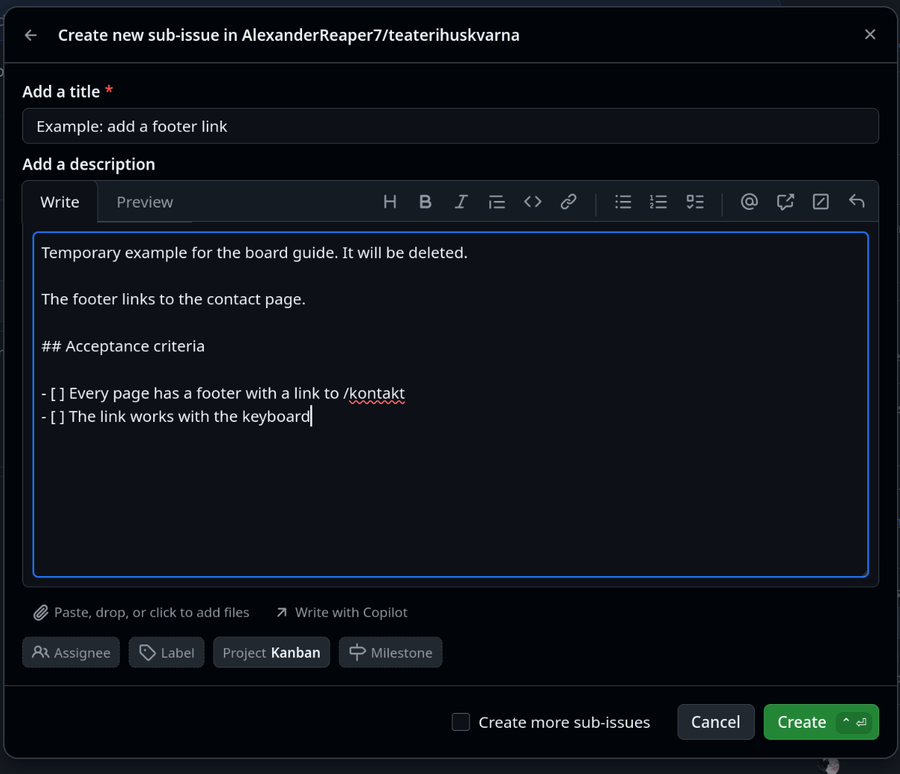
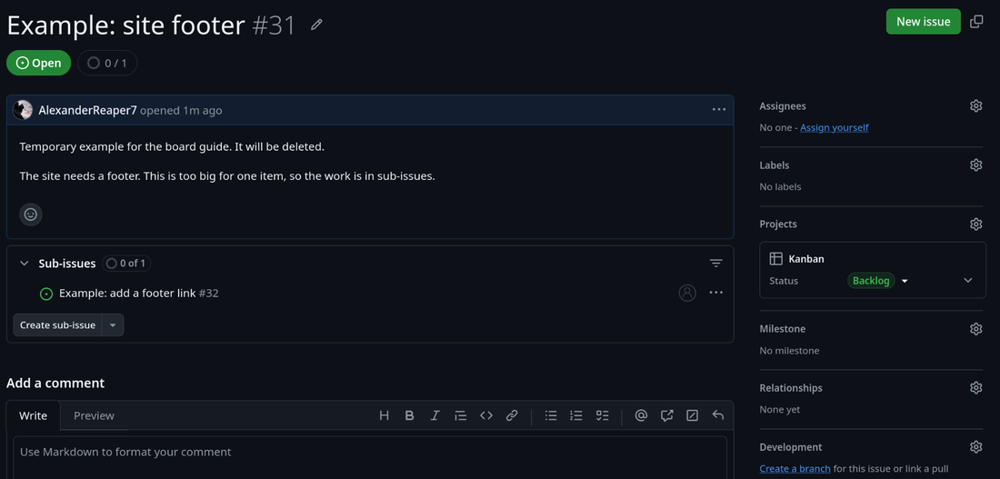
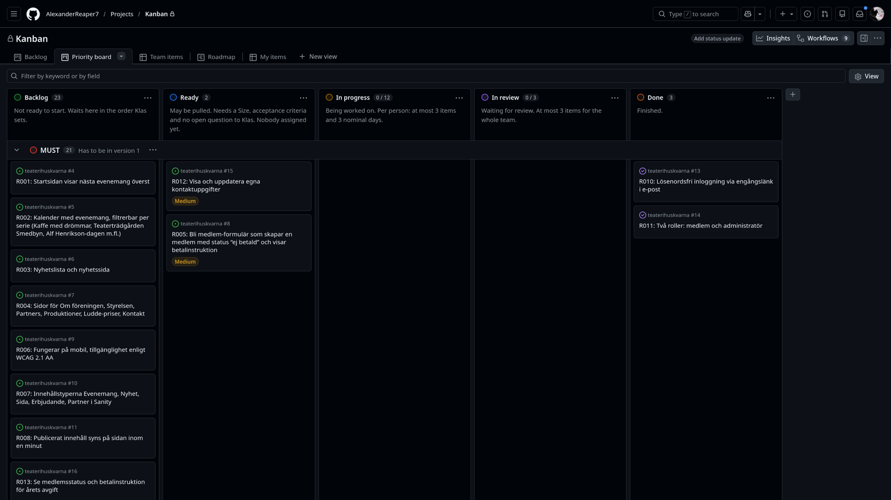

# How to use the board

This guide is for someone who has never worked with a task board. It covers the [Kanban board](https://github.com/users/AlexanderReaper7/projects/1) on GitHub: what is on it, how to take work from it, and the few rules that keep it useful. It does not cover branches, commits or pull requests.

The rules come from [decisions/0018](decisions/0018-kanban-with-weekly-syncs.md), which also says why. When this guide and 0018 disagree, 0018 is right and this guide needs fixing.

The screenshots show a made-up example, "Example: site footer", which was deleted after the pictures were taken. You will not find it on the board.

## The idea

All the work on the project is written down as issues. Each issue is a card on the board, and the board has one column for each stage a piece of work goes through. When you work on something, its card sits in your column. Anyone can open the board and see who is doing what, what is waiting, and what is stuck, without asking.

Two rules make it work:

1. **You pull work, nobody hands it to you.** When you have room, you take the top card from Ready and put your name on it.
2. **You limit how much you have going at once.** Finishing one thing beats having four things half done.

That is what "Kanban" means here. There are no sprints. Work flows through the board continuously, and the team meets every Monday to look at it together.

## Words you will see

| Word | What it means |
| --- | --- |
| Issue | A written piece of work on GitHub, with a title, a description and a number such as `#32`. |
| Card | How an issue looks on the board. Moving a card between columns changes the issue's Status. |
| Column | One stage: Backlog, Ready, In progress, In review, Done. |
| Requirement | One thing the customer asked for, listed in [requirements.md](requirements.md) with an id such as R012. Each requirement is one issue. |
| Sub-issue | An issue that belongs to a bigger issue, its parent. |
| Work item | An issue without sub-issues. This is what you actually do. It has a size. |
| Supertask | An issue with sub-issues. You never work on it directly, you work on its sub-issues. It has no size. |
| Size | How big a work item is: Small, Medium or Large. |
| WIP limit | "Work in progress" limit, the most cards allowed in progress or in review at once. |
| Sync | A short meeting, at most 15 minutes, to get something unstuck. |
| Klas | The product owner, who speaks for the customer and decides the order of the work. |

The [glossary](../GLOSSARY.md) has the exact definitions.

## The board

Open the board from the link above. The tabs along the top are different views of the same cards. **Backlog** is the one to use day to day.

Each column's rule is written at its top:

| Column | What is in it | Who moves cards in |
| --- | --- | --- |
| Backlog | Work that is not ready to start, in the order Klas sets. | GitHub, when an issue is created |
| Ready | Work anyone may start. It has a size, acceptance criteria, and no open question to Klas. Nobody is assigned yet. | The team, when it sizes an item |
| In progress | Work someone is doing right now. | You, when you start |
| In review | Work that is finished and waits for someone else to check it. | You, when you are done |
| Done | Finished and closed. | GitHub, when the issue closes |

The numbers next to a column name count its cards. In progress shows `0 / 12` and In review `0 / 3`: the second number is the limit, explained under [Limits](#limits).

A card shows the repository and issue number, the title, and its fields. The coloured tags are Priority (MUST, SHOULD, COULD) and Size (Small, Medium, Large). A face in the corner is whoever is assigned. A supertask shows a progress bar counting its closed sub-issues.

## A card's trip across the board

This is one work item going from Backlog to Done:

The steps, one at a time:

### 1. Pick the top card in Ready

Take the card at the top of Ready. The order is Klas's, so the top card is the one that matters most right now. Before you take it, check the [limits](#limits): if you already have three cards in progress, finish one first.

If Ready is empty, tell the team, and break down the next requirement together, see [How cards get into Ready](#how-cards-get-into-ready). Nobody should start work from Backlog, because those cards are not ready yet: they may be missing a size, or have an open question.

### 2. Open it and assign yourself

Click the card's title. A panel opens on the right with the whole issue.

Read the description and the acceptance criteria. Acceptance criteria are the list of things that must be true when the work is finished. They are how you, and the reviewer, know when you are done. If something is unclear, ask before you start, not after.

Then click **Assign yourself** under Assignees, at the top right of the panel. Your name on the card tells everyone the card is taken.

Leave the Size alone. It was set when the card entered Ready and it never changes afterwards, even if the work turns out bigger or smaller. That is on purpose: comparing the size with how long it really took is how the team learns to estimate.

### 3. Drag it to In progress

Close the panel with <kbd>Esc</kbd>, then drag the card from Ready into In progress. You can also change **Status** in the panel instead of dragging.

The day you move it counts as your first day on it. See [Sizes](#sizes-and-how-long-an-item-may-take) for why that matters.

### 4. Do the work, and tick off what is done

The acceptance criteria are checkboxes. Tick each one when it is true. Anyone looking at the issue then sees how far you are.

If you get stuck, say so the same day. Waiting a day to ask costs the team a day.

### 5. Drag it to In review

When all the criteria are ticked, drag the card to In review. Someone else now checks the work. While it waits there, its days stop counting toward the maximum.

If the reviewer finds something to fix, the card goes back to In progress.

### 6. Done happens by itself

When the issue closes, GitHub moves the card to Done, so there is nothing to drag.

## Sizes, and how long an item may take

Every work item has one of three sizes:

| Size | Nominal, the time it should take | Maximum, days in progress before a sync |
| --- | --- | --- |
| Small | Half a day | 2 working days |
| Medium | 1 day | 3 working days |
| Large | 3 days | 5 working days |

Time is counted in whole days. A day counts if the card was in In progress at any point that day, and the first and last day both count. Days in In review do not count. So a Small started Tuesday afternoon and moved to review Wednesday morning has used 2 days, which is its maximum and still fine. On Thursday it would be over.

**When a card passes its maximum, the team holds a sync.** That is not a punishment. It means the estimate was wrong or something is blocking you, and both are things the team needs to know. The sync is at most 15 minutes, and it ends when the problem has someone who owns it and a next step.

Anything bigger than a Large is not one work item. It becomes a supertask with sub-issues, see [Splitting work](#splitting-work-into-sub-issues).

Anything under about an hour does not get its own card either. Write it as a checklist line in the issue it belongs to.

## Limits

The limits exist so that work gets finished instead of started:

| Limit | Number |
| --- | --- |
| Cards in progress, per person | 3 |
| Nominal days in progress, per person | 3 |
| Cards in review, for the whole team | 3 |

Nominal days add up the sizes you have in progress. Two Mediums are 2 days, so you have room for a Small but not a Large.

GitHub shows the team's totals in the column headers, `0 / 12` for In progress and `0 / 3` for In review. It only counts. It does not stop you from dragging a card into a full column, and it does not know about the per-person limits at all. Those are yours to keep. The **My items** view shows your own cards:

When In review is full, do not start something new. Review someone else's card first. That is the fastest way to get your own card moving again.

A script will check the board every weekday morning and report broken limits and cards past their maximum, as a comment on the issue labelled `board report`. It needs a machine account that does not exist yet, [#30](https://github.com/AlexanderReaper7/teaterihuskvarna/issues/30), so until then nobody checks but you.

## Splitting work into sub-issues

Every requirement is an issue, and most requirements are too big for one work item. The work goes in sub-issues under the requirement's issue. That turns the requirement into a supertask.

To add one, open the parent issue and click **Create sub-issue** under its description:

Give it a title that says what will exist when it is done, a short description, and acceptance criteria as a checklist:

The parent now lists the sub-issue, and counts how many are closed:

The new sub-issue lands in Backlog on its own. It does not have a size yet. Sizing happens as a team, see the next section.

A good work item:

- is small enough to be a Small, Medium or Large
- has acceptance criteria that someone else can check
- can be reviewed on its own

## How cards get into Ready

Ready is filled at the Monday week-start sync. The team takes the requirements Klas put at the top, splits them into sub-issues, and agrees a size for each work item together. Then someone drags each one from Backlog to Ready.

The size is agreed before anyone is assigned, and it is the same whoever ends up doing the work.

Before a card goes to Ready, check its column rule: it has a size, it has acceptance criteria, and it has no open question to Klas. A question for Klas goes in the next meeting's document under [meetings](meetings/), and the card waits in Backlog until the answer comes.

Ready should never run dry. If it holds fewer cards than there are people on the team, four, the team breaks down the next requirement then and there, without waiting for Monday.

## Meetings

| Meeting | When | Length |
| --- | --- | --- |
| Week-start sync | Every Monday at about 09:00. Everyone comes. | Up to 1 hour |
| Product owner meeting with Klas | Weekly, probably Thursday. Klas sees finished work and sets the order. | At least 1 hour |
| Retrospective | Friday of weeks 3, 5, 7, 9 and 11, and in week 12 | Not set |
| Sync | Whenever anyone calls one, or a card passes its maximum | At most 15 minutes |

The retrospective is where the team talks about how it works, not what it builds. If a rule in this guide keeps getting in the way, bring it up there.

## The other views

The tabs at the top show the same cards arranged differently.

**Priority board** splits the board into rows by Priority. MUST has to be in version 1, SHOULD ought to be, COULD can wait for phase 2.

**Team items** is a table grouped by Status, handy for scanning everything at once.

**My items** shows only the cards assigned to you.

**Roadmap** shows cards on a timeline.

Typing in **Filter by keyword or by field** narrows any view. Filtering is only for you: GitHub offers a **Save** button afterwards, which changes the view for everyone. Click **Discard** instead.

## What GitHub does by itself

| When | GitHub |
| --- | --- |
| An issue is opened in this repository | Adds it to the board, in Backlog |
| A sub-issue is added to an issue on the board | Adds the sub-issue to the board |
| An issue closes | Moves its card to Done |
| A card is moved to Done | Closes the issue |
| An issue is reopened | Moves its card back to Backlog |
| A pull request is linked to an issue | Moves the issue's card to In progress |
| A closed card has not changed in four weeks | Archives it, so it leaves the board |

The pull request one can surprise you. If your card is already in In review and a pull request gets linked to it afterwards, the card jumps back to In progress. Drag it back.

## Common mistakes

- **Starting a card from Backlog.** It is not ready. Ask the team to size it at the next sync, or right away if Ready is empty.
- **Forgetting to assign yourself.** Two people then do the same work.
- **Taking a fourth card because the third is waiting on something.** Say what you are waiting on instead. That is what a sync is for.
- **Changing the Size.** It stays what the team agreed, even when it was wrong.
- **Working on a supertask.** Work happens in its sub-issues. A supertask has no size.
- **Saving a filter.** It changes the view for everyone.
