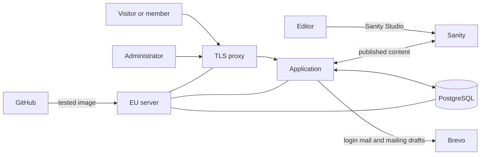

# First customer meeting

2026-09-24

The technical plan first, then the questions for the association. The full plan is [projektplan.md](../projektplan.md), and each choice below has a decision record in [decisions/](../decisions/).

## Part 1: the technical plan

### Two systems, split by what they hold

Sanity holds what the public reads: events, news, pages, partners. The application holds everything about members: the register, fees, registrations, volunteer bookings and logins. The member register never goes to Sanity.

- Editors write in Sanity Studio, which Sanity runs. The association keeps no editing server up to date.
- A published change reaches the site within one minute.
- The application, its database and the HTTPS proxy run on one server in the EU.
- Brevo delivers login mail and member mailings.

### Where the plan differs from the association's sketch

The sketch was a proposal, and most of it stands. Five points changed, each for a stated reason.

| The sketch | The plan | Why | Record |
| --- | --- | --- | --- |
| Azure, with a managed database | One EU server running everything in containers | A managed database starts around 25 USD a month. One server costs a few euros a month. The Azure grant is not applied for yet, so it would be headroom, not a dependency | [0007](../decisions/0007-postgres-in-a-container.md), [0008](../decisions/0008-everything-in-containers.md) |
| Mailings are previewed, sent and logged in the admin view | The application builds a draft in Brevo, and the administrator test-sends and sends it there | Brevo already has preview, test sends, unsubscribe handling and history. Building them again costs weeks. The cost is a second tool for administrators, which is question C18 | [0005](../decisions/0005-brevo-campaign-drafts.md) |
| No personal data in Sanity | Names and photographs of the board and performers are in Sanity | The board and production pages cannot exist without them. The member register still never goes there | [research](../research/sanity-personal-data.md) |
| Volunteer booking was a B requirement | It is a MUST | The sketch's own scope table puts it in version 1, and the scope table wins where the document contradicts itself | [requirements](../requirements.md) |
| Thymeleaf for pages | JTE | Thymeleaf was chosen as the students' course material. The choice was reopened on its merits once that reason no longer held | [0004](../decisions/0004-jte-for-templates.md) |

### Logging in without a password

- A member types their email address and gets a mail with a link and a six-digit code.
- The link works only in the browser that asked for it. Someone reading the mail on their phone types the code into the waiting page instead. A link forwarded or caught by someone else logs nobody in.
- The page answers the same whether or not the address belongs to a member, so the login page cannot be used to find out who is a member.
- A member login lasts 30 days and an administrator login 8 hours, counted from the login. Two minutes before the end the page counts down and offers to extend it.
- Each person sees the devices they are logged in on and can log any of them out.
- Anyone can also add a passkey, a fingerprint or screen lock login. The requirements did not ask for it, and the email link always keeps working.

Records: [0015](../decisions/0015-login-links-on-spring-security.md), [0016](../decisions/0016-passkeys-beside-links.md).

### What exists today

The project started on 2026-09-21. The foundation that every later feature builds on is in place:

- member login and administrator login (I1, I2), including passkeys and the device list;
- the Bli medlem form with email confirmation and a welcome page with payment instructions (P5, partial);
- the member's own page with name, email and household (M1, partial);
- administrators adding and removing each other. Removal is refused while two or fewer remain, which enforces the plan's rule of at least two board members with access.

How it is checked:

- 111 integration tests against a real PostgreSQL run on every push;
- 217 browser tests in Chromium and Firefox run on request, because a run takes about three minutes;
- three static analysis tools fail the build on a finding;
- everything the pages can do, a REST API can do too. The build fails if the API falls behind ([0014](../decisions/0014-one-service-layer-two-adapters.md)).

Not in place yet: the deployment pipeline and a test environment reachable from outside, which the plan's first sprint promised.

### The proposed order of work

Each step lists the questions from [open-questions.md](../open-questions.md) that block it.

1. **Test environment and deployment.** A pushed change that passes the tests deploys itself to an EU server. Needs a server account in the association's name, and the GitHub organisation (C7).
2. **The member register for administrators.** Search, add, change and remove members, mark fees paid, households, CSV export (A1, A2, A4, M2). Blocked by C9 and C11, and by C10 for the bankgiro number.
3. **Sanity and the public site.** Content types, start page, calendar, news and the fixed pages (R1 to R3, P1 to P4). Blocked by the design questions C19, C20, C21 and C23, and C16 for offers.
4. **Offers and volunteer booking.** Registrations with places left, volunteer shifts, and exports for administrators (M3, V1, A3).
5. **Mailings.** Choose an audience and content, create the Brevo draft (U1 to U3). Blocked by C18 and C5.
6. **Launch work.** Accessibility review, migrating content from WordPress, a tested backup restore, the runbook, handover to the maintainer (P6, C2, C6).

### What it costs to run

| Service | Cost | Limit that matters |
| --- | --- | --- |
| EU server | A few euros a month | One server. An hour of downtime is acceptable for an association site |
| Sanity | 0 kr on the Free plan, or on the nonprofit plan if approved | Published content on Free is public, so member-only offer details need the nonprofit plan or the application (C16) |
| Brevo | 0 kr up to 300 mails a day | Above that, a mailing spreads over several days or needs a paid plan (C5) |
| GitHub and the image registry | 0 kr | GitHub's own wording is "currently free" |

## Part 2: questions for the association

This part is a copy of "For this meeting" in [open-questions.md](../open-questions.md), taken on 2026-09-24. That file stays the list of record. An answer given at the meeting goes there, or into the plan or a decision record, and the question is deleted. Some questions are quoted in Swedish from the produktägare's plan and stay that way per [decisions/0001](../decisions/0001-language-policy.md).

The order starts with a fact, moves to what the site does and how it looks while the screenshots are on screen, then personal data, and ends with who does what.

### The association today

- [ ] **C5. Hur många medlemmar har föreningen idag?** From the original plan. The number decides the Brevo plan, because the free plan stops at 300 mails a day, and the size of the system.
 **115 members, be able to grow to 200.**
### What the site does

- [ ] **C9. Does a Bli medlem application become a member when the applicant confirms their email address, or when an administrator approves it?** Requirement P5 says the form creates a member, but a form that writes straight into the register lets bots fill it and puts them in every mailing, so one of the two is needed. Built for now as "a member with an account once the email address is confirmed".decide later
- [ ] **C11. Must a household have added all its members before it pays the family fee, or is the family fee bound to the account, so members can be added and changed after paying?** The produktägare's wording is "50 kr enskild, 100 kr familj". An application is for one person, and household members are added only after the member exists, by an administrator or by a member of the household. The answer decides what the page after a confirmed application says about the fee, and what "paid" means for a person added to a household later in the year. **Upto the team to decide.**
- [ ] **C16. Are offer descriptions and discount details public, or for members only?** Anything published in a Free Sanity dataset is public. Member-only details need the nonprofit plan's private dataset from C8, or storage in the application. **members only** **
- [ ] **C18. May mailings be sent from Brevo instead of the admin view?** The original flow previews, sends and logs a mailing in the application. [decisions/0005](../decisions/0005-brevo-campaign-drafts.md) has the application create a draft in Brevo, where the administrator test-sends and sends it, and Brevo's campaign history is the log (U2, U4). Built as 0005 says until this is answered.
**YES**
### How the site looks

The produktägare said they liked the old site's graphics. [design/old-site](../../design/old-site/README.md) surveys that design. Have its screenshots open.

- [ ] **C20. Which part of the old graphics should the new site keep?** The typing hero ("FÖRENINGEN TEATER I HUS" + VAGN, KUR, DJUR, ARREST, KVARNA), the teal and mint palette, the layout, or the logo. The survey's guess is the typing hero, so show [home.png](../../design/old-site/screenshots/home.png) first. **members should be recognize thenewpagefrom the old pages visual style.**
- [ ] **C23. May the orange `#ee6810` be darkened to `#b64f0c`?** The current orange fails the WCAG 2.1 AA contrast that requirement P6 makes a MUST. The darker value passes on white and on mint and reads as the same colour. Orange on teal has no passing value, so footer icon hover would change to white or mint. **up to the team**
- [ ] **C21. Does the association have original files for its artwork, and the right to use them?** The website only has raster copies, and neither can be scaled up.
  - The logo, as a vector file, and in a dark-on-light version. The web copy is a white-on-dark PNG that cannot be recoloured.**the original files exist and the art is owned.**
  - Jätten Vist. Who drew it, and does the association have the original and the right to use it? The web copy is 180x338 pixels.
 **we are allowed to use it. dontknow if we have the original file.**
### Personal data

The board's obligations, which the system cannot carry for them.

- [ ] **C13. How long is data about members who have not renewed kept?** From the original plan. The answer covers database backups too, not only the live database ([decisions/0007](../decisions/0007-postgres-in-a-container.md)). **send a reminder to pay the year in january, if they havent paid by end of june then they will be removed from the member list.**
- [ ] **C14. How is consent for photographs handled, and who holds it?** Requirement P4's board and production pages publish names and photographs of identifiable people. That needs a lawful basis, an image release for performers, a practice for audience shots, and an answer for when someone asks to be removed. **Children in productions need this settled before the first photo is uploaded.** The board runs this process, and the system cannot enforce it. **consent is managed manually, and removal is manual.**
- [ ] **C15. Who writes down the purpose and lawful basis for each kind of personal data the association keeps?** The plan requires it. Sanity holds names and photographs, the application holds the member register, and Brevo holds mail addresses.
 **up to the board. its on the board to be responsible. **
### Who does what

Each answer here is a name and a date, so the meeting ends with its action items.

- [ ] **C6. Should the domain and the WordPress site be moved or shut down at launch?** Pointing teaterihuskvarna.se at the new site waits for this answer. If anything keeps running on a subdomain such as `www.`, that affects how login cookies are scoped ([decisions/0015](../decisions/0015-login-links-on-spring-security.md)). **same domain, just change which application is running
- [ ] **C7. Who creates a GitHub organisation for the association, on `webb@teaterihuskvarna.se`?** The repository currently lives under the personal account AlexanderReaper7 and moves there once it exists ([decisions/0002](../decisions/0002-accounts-under-a-personal-login.md)). **Klas does (the customer)**
- [ ] **C8. Who applies for the three nonprofit programmes, and when?** Each is a separate application, and the association has to validate as a nonprofit first. **Klas does. will do it by next meeting.**
  - GitHub for Nonprofits, needs the organisation from C7. It gives free GitHub Team, which is what makes branch protection on a private repository possible ([decisions/0003](../decisions/0003-no-branch-protection-yet.md)).
  - [Sanity's nonprofit plan](https://www.sanity.io/docs/platform-management/non-profit-plan), after the Sanity project exists. It gives private datasets, Growth roles and 25 users at no charge. The Free plan is the fallback ([decisions/0006](../decisions/0006-sanity-for-now.md)).
  - Microsoft's Azure credit. The original plan asks whether to apply at all. It is 2 000 USD a year, does not roll over, and expires 90 days after issuance if not activated. Hosting is costed without it ([decisions/0007](../decisions/0007-postgres-in-a-container.md)), so this is headroom, not a blocker.
