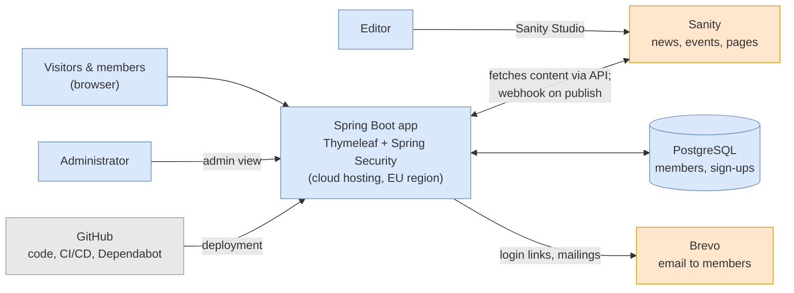
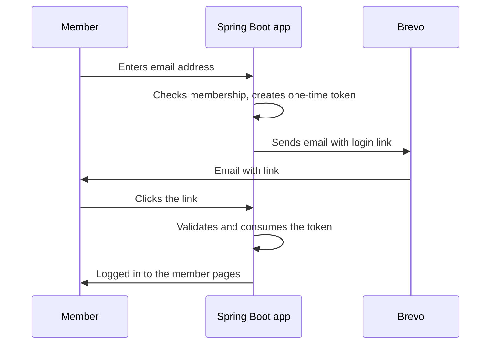
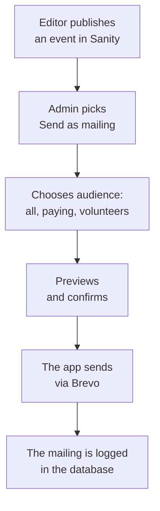

# New website for Föreningen Teater i Huskvarna – project plan and system sketch

2026-09-21 · Klas Åkerskog, chair and product owner

> English translation of [projektplan-original.md](projektplan-original.md), which is itself a verbatim conversion of `projektplan-source.docx`. The Swedish file is the source of record; this one is for readers who do not read Swedish. Do not edit either by hand. The working lists are in [requirements.md](requirements.md) and [open-questions.md](open-questions.md).
>
> Priority letters are kept as in the Swedish original so requirement ids match across files: M = måste (must be in version 1), B = bör (should), K = kan (can wait for phase 2).

## Background and purpose

Föreningen Teater i Huskvarna is getting a new website that is easy to update and that makes reaching the members simple. Four Java students from Lexicon build it during a 12-week APL period (workplace-based learning placement), mentored by a local consultancy.

The current site, [teaterihuskvarna.se](https://teaterihuskvarna.se/news/), is built in WordPress. The most recent news item is from spring 2025, so the site has gone more than a year without an update.

Today almost all member contact runs through individual board members' private email addresses and phone numbers:

- Sign-ups for the annual meeting and for discounted tickets go to private Gmail and Hotmail addresses.
- Revue volunteers tick the performances they want and email a private individual.
- The membership fee (50 kr individual, 100 kr family) is paid by bankgiro with the name in the message field.

The purpose of the project is therefore to simplify the workflow, not merely to swap out the technology. It should be possible to publish an event in a few minutes, reach every member with one click, and move the knowledge out of individual heads into a shared system.

## Goals and scope

Version 1 goes live in week 12 with the public site, editing, member login and mailings. Everything else is phase 2.

| **In version 1** | **Out of scope (phase 2 or later)** |
|----|----|
| Public site with news, events, association info, partners, Ludde awards | Payment by Swish or card directly on the site |
| Editing of all public content in Sanity | A dedicated mobile app |
| Passwordless member login via emailed link | Ticket sales (these stay with Nortic, Tickster and others) |
| Member pages with offers and sign-up | Chat or forum for members |
| Volunteer booking for coat check and refreshments | Automatic reconciliation against the bank |
| Admin view for the member register and manual marking of paid fees | SMS messaging |
| Email mailings to selected audiences | Multiple languages |
| Migration of relevant content from the current site |  |

Measurable goals after launch:

- An editor with no technical background can publish an event in under 10 minutes.
- A mailing to all paying members can be sent in under 5 minutes.
- No private email addresses or phone numbers remain on the public site.

## Roles and responsibilities

Every role except maintainer needs to be filled from week 1. Names go in once they are settled.

| **Role** | **Who** | **Responsibility** | **Time** |
|----|----|----|----|
| Product owner | Klas Åkerskog, chair | Point of contact for the students; prioritises the backlog, answers questions, approves deliveries | approx. 2 h/week |
| Editors (2–3) | From the association (not yet appointed) | Test editing in weeks 10–11, publish after launch | approx. 2 h in weeks 10–12 |
| Technical mentor | Consultancy (not yet chosen) | Architecture decisions, code review, weekly check-in | approx. 4–6 h/week |
| APL coordinator | Lexicon | Contact with the school, APL goals and assessment | Per Lexicon's arrangement |
| Developers (4) | Lexicon students, Java track | Build, test and document according to plan | Full time, 12 weeks |
| Maintainer | Decided by week 10 at the latest | Updates and bug fixes after the APL period | A few hours per year |

The hour estimates are proposals and are to be confirmed with the consultancy and Lexicon.

## System sketch

The system has two parts: Sanity for public content, and a Spring Boot app for everything that concerns members. Personal data is stored only in the app's own database, never in Sanity.

*System overview*

Editors work in Sanity, administrators in the app's admin view. The app fetches content from Sanity and caches it, and a webhook clears the cache when something is published.

### Components

| **Component** | **Role** | **Built or configured** |
|----|----|----|
| Sanity Studio | Editing of public content | Content models are configured (TypeScript) |
| Spring Boot app | Renders the site, member area, admin view | Built by the students |
| Spring Security One-Time Token | Passwordless login | Configured; the email sending is built |
| PostgreSQL | Member register, sign-ups, volunteer shifts | Data model is built |
| Brevo | Delivery of login links and mailings | API integration is built |
| GitHub Actions | Tests, build and deployment | Configured |
| Dependabot | Automatic suggestions for dependency updates | Configured |

### Flow: member login

*Member login flow*

The token can be used only once and has a short lifetime. Unknown email addresses get the same response as known ones, so the site does not reveal who is a member.

### Flow: mailings

*Mailing flow*

The mailing is built from the content in Sanity, so the text is written only once.

## Functional requirements

The requirements are prioritised: M = must be in version 1, B = should be there, K = can wait for phase 2. Each requirement becomes one or more items in the backlog.

| **Id** | **Area** | **Requirement** | **Prio** |
|----|----|----|----|
| P1 | Public site | The home page shows the next event at the top | M |
| P2 | Public site | Calendar of events, filterable by series (Kaffe med drömmar, Teaterträdgården Smedbyn, Alf Henrikson-dagen and others) | M |
| P3 | Public site | News list and news page | M |
| P4 | Public site | Pages for About the association, The board, Partners, Productions, Ludde awards, Contact | M |
| P5 | Public site | A join form that creates a member with status "not paid" and shows payment instructions | M |
| P6 | Public site | Works on mobile; accessibility per WCAG 2.1 AA | M |
| R1 | Editing | The content types Event, News item, Page, Offer, Partner in Sanity | M |
| R2 | Editing | Published content appears on the site within one minute | M |
| R3 | Editing | Preview before publishing | B |
| I1 | Login | Passwordless login via a one-time link in an email | M |
| I2 | Login | Two roles: member and administrator | M |
| M1 | Member pages | View and update one's own contact details | M |
| M2 | Member pages | See membership status and payment instructions for this year's fee | M |
| M3 | Member pages | See offers and sign up, with the number of seats left | M |
| M4 | Member pages | Annual meeting documents and member letters | B |
| V1 | Volunteers | Book shifts for coat check and refreshments per performance | B |
| V2 | Volunteers | Email reminder the day before the shift | K |
| A1 | Admin | Search, add, change and delete members | M |
| A2 | Admin | Mark a fee as paid, handle family memberships | M |
| A3 | Admin | View and export sign-ups per offer and volunteer shift | M |
| A4 | Admin | Export the member register as CSV | M |
| U1 | Mailings | Send a mailing to a chosen audience, based on content from Sanity | M |
| U2 | Mailings | Preview and send a test to oneself | M |
| U3 | Mailings | Unsubscribe link in every mailing | M |
| U4 | Mailings | Log of sent mailings | B |

## Technology choices and rationale

The guiding principle is little custom code on top of proven parts: what is unique to the association gets built, everything else is bought as a service or framework.

| **Choice** | **Rationale** | **To verify before start** |
|----|----|----|
| Sanity as CMS | A ready-made editing interface that the vendor operates, no CMS server to keep updated. The free plan may be used in production | The free plan's limits: sources state either 20 users, 10,000 documents and 1 million cached API calls/month, or only 2 users beyond admin and 500,000 calls. Exceeding the quota shuts the feature off rather than billing |
| Spring Boot + Thymeleaf | The students' training language. Server rendering means fewer dependencies than a separate JavaScript front end | The latest stable versions of Java LTS and Spring Boot at the time of start |
| Spring Security One-Time Token | Built-in passwordless login since Spring Security 6.4 / Spring Boot 3.4 | That tokens are stored in the database (not in memory) in production |
| PostgreSQL | Standard database, supported by every major cloud provider | Operating model: a managed database service |
| Brevo for email | Free plan with 300 emails/day and support for transactional email via API | Number of members: above 300 means spreading a mailing over several days or a paid plan. Sources give different starting prices for the paid plan (9 or 25 USD/month) |
| Hosting on Azure | Microsoft gives approved nonprofits 2,000 USD in Azure credits per year | That the association passes Microsoft's validation. The credit renews annually and does not roll over |
| GitHub + Actions + Dependabot | Automatic tests, deployment and dependency updates reduce maintenance to approving changes | That the repository lives in an organisation the association owns |

Trade-offs: Sanity Studio is configured in TypeScript, so the students write a little JavaScript. If Sanity changes its free terms, the association has to pay or move the content, which can be exported but costs work.

## Timeline

The project runs as six two-week sprints. The start date is not set, so the plan is given in weeks.

The students split into two tracks that meet in sprint 5:

- **Track 1 – public site (2 students):** content model in Sanity, integration with Spring Boot, templates, content migration, accessibility.
- **Track 2 – member area (2 students):** data model, login, member pages, admin view, mailings, volunteer booking.

| **Sprint** | **Weeks** | **Track 1 – public site** | **Track 2 – member area** | **Joint delivery** |
|----|----|----|----|----|
| 1 | 1–2 | Requirements walkthrough with the product owner, sketches, content model | Requirements walkthrough, data model | Repository, CI/CD, test environment running; sketches approved |
| 2 | 3–4 | Sanity Studio set up, home page and events | Login with one-time link, member register | First runnable version in the test environment |
| 3 | 5–6 | News and the remaining pages, cache webhook | Admin view: members, marking fees paid, export | An editor can publish; an admin can manage members |
| 4 | 7–8 | Content migration, join form | Member pages, offers and sign-up | All M requirements done for each track |
| 5 | 9–10 | Accessibility review, mobile adaptation | Mailings via Brevo, volunteer booking | Integrated whole; decision on the maintainer |
| 6 | 11–12 | Test with real editors, fixes | Test with administrators, fixes | Deployment to production, documentation, handover |

Every sprint ends with a demo for the product owner and the mentor. If something has to be cut, B and K requirements go first.

## Ways of working

The team works in two-week sprints with the backlog in GitHub Projects and all code going through reviewed pull requests.

| **Activity** | **When** | **Participants** | **Purpose** |
|----|----|----|----|
| Daily stand-up | Every morning, 15 min | The students | What was done, what is being done, what is blocking |
| Mentor meeting | Once a week, 1 h | Students + mentor | Architecture, code quality, technical choices |
| Sprint planning | First day of the sprint | Students + product owner | Pick items from the backlog |
| Demo and retro | Last day of the sprint | Everyone | Show results, gather feedback, improve the way of working |

### Rules for code

- No code straight to the main branch; every change is reviewed by at least one other student.
- The mentor reviews changes that touch security, login and personal data.
- Development runs against made-up test data, never real member details.

### Definition of done

An item is done when:

- [ ] The code is reviewed and merged.
- [ ] Automated tests exist and pass.
- [ ] The feature works in the test environment, on mobile too.
- [ ] The documentation is updated (README, operations manual or editor manual).
- [ ] The product owner has approved the feature at a demo.

## Maintenance and ownership

The association owns everything from day 1, and the maintainer is to be appointed by week 10 at the latest.

### Ownership

Every account is registered to a role address the board owns, for example webb@teaterihuskvarna.se, never to a student or an individual board member:

- The GitHub organisation holding the repository
- The domain teaterihuskvarna.se
- The Sanity project
- The Brevo account
- The hosting account (Azure or equivalent)

At least two people on the board have administrator access to each account.

### Maintenance model

1.  **First choice:** the next APL cohort from Lexicon's Java track takes over maintenance and further development.
2.  **Fallback:** a maintenance agreement with the consultancy for security updates and urgent faults between cohorts.
3.  **Automation:** Dependabot proposes updates, and the automated tests show whether they can be approved.

### Documentation as a deliverable

- **Operations manual:** how the system is deployed, updated and restored from backup.
- **Editor manual:** short screen recordings for publishing events, news and mailings.
- **Architecture description:** this system sketch, updated to how the system actually turned out.
- **README:** how a new developer gets running locally in under an hour.

## Personal data and security

The association becomes the data controller for the member register in its own system and has to be able to show how the data is protected.

- **Minimise data:** name, email, phone, address and household are enough. No personal identity number.
- **Data processing agreements** are signed with Brevo and the hosting provider, since they process member data. Sanity gets no personal data.
- **Storage within the EU:** the database and hosting are placed in an EU region.
- **Access:** only appointed administrators see the member register. The students work with test data and have no access to production data.
- **Cleanup:** members who have not renewed after a set period are anonymised or deleted. The board decides the period.
- **Consent for mailings:** member information is sent on the basis of the membership. Every mailing has an unsubscribe link.
- **Security:** HTTPS everywhere, one-time tokens with a short lifetime, protection against repeated login attempts, daily database backups.
- **Record of processing:** a short description of which data is processed and why is produced as part of the documentation.

## Risks and mitigations

The biggest risk is that the system is orphaned after week 12. The second biggest is four junior developers taking on too much.

| **Risk** | **Likelihood** | **Impact** | **Mitigation** |
|----|----|----|----|
| No maintainer after the APL period | Medium | High | A maintainer is appointed by week 10; fallback agreement with the consultancy |
| Scope too large, version 1 does not get finished | High | High | Strict prioritisation; B and K requirements cut first; a demo every sprint |
| The product owner does not have time | Medium | High | Appoint a stand-in from the start; a fixed time each week |
| Mentoring is missing or insufficient | Medium | High | Agreement with the consultancy in place before start; review of security-related code |
| Sanity changes its free terms | Low | Medium | Content can be exported; budget for a paid plan if needed |
| More than 300 members hits Brevo's daily limit | Unknown | Low | Check the member count; spread the mailing out or upgrade |
| The Azure credit is not granted | Unknown | Medium | Apply early; compare with cheaper hosting as a fallback |
| Personal data leaks from the test environment | Low | High | Test data only in development; access to production restricted |
| Editors find it awkward | Medium | High | Real editors test in sprint 6; screen recordings as a manual |

## Open questions and decisions

These need answers before sprint 1:

- [ ] How many members does the association have today? (Determines the Brevo plan and the size of the system.)
- [ ] Who stands in for the product owner during absence?
- [ ] Which consultancy mentors the team, and on what terms (paid or partnership)?
- [ ] Who maintains the system after the APL period: the next Lexicon cohort, the consultancy, or both?
- [ ] Start date of the APL period.
- [ ] Should the board apply to Microsoft's nonprofit programme for Azure credits?
- [ ] Should the domain and the existing WordPress site be migrated or shut down at launch?
- [ ] How long is data about members who have not renewed kept?

## Sources

- [Teater i Huskvarna – News](https://teaterihuskvarna.se/news/)
- [Spring Security – One-Time Token Login](https://docs.spring.io/spring-security/reference/servlet/authentication/onetimetoken.html)
- [Sanity – Pricing](https://www.sanity.io/pricing)
- [Sanity – Plans and payments](https://www.sanity.io/docs/platform-management/plans-and-payments)
- [Brevo review (TechRadar)](https://www.techradar.com/pro/software-services/brevo-review)
- [Microsoft for Nonprofits – Claim and activate the Azure grant](https://learn.microsoft.com/en-us/industry/nonprofit/microsoft-for-nonprofits/claim-activate-nonprofit-azure-grant)
