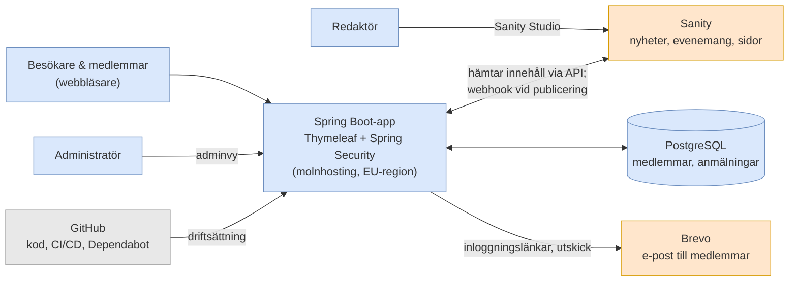
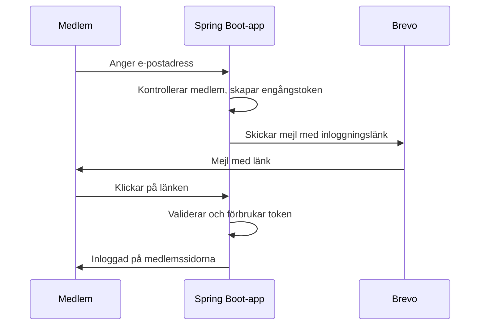
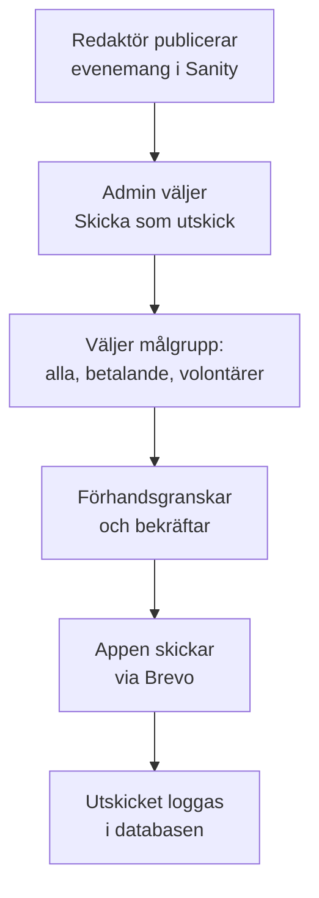

# Ny webbplats för Föreningen Teater i Huskvarna – projektplan och systemskiss

2026-09-21 · Klas Åkerskog, ordförande och produktägare

> Ordagrann konvertering av `projektplan-source.docx`. Ändra inte den här filen; arbetslistorna finns i [requirements.md](requirements.md) och [open-questions.md](open-questions.md).

## Bakgrund och syfte

Föreningen Teater i Huskvarna ska få en ny webbplats som är lätt att uppdatera och som gör det enkelt att nå medlemmarna. Den byggs av fyra Java-studenter från Lexicon under en APL-period på 12 veckor, med handledning från ett lokalt konsultbolag.

Nuvarande sida, [teaterihuskvarna.se](https://teaterihuskvarna.se/news/), är byggd i WordPress. Den senaste nyheten är från våren 2025, alltså har sidan inte uppdaterats på över ett år.

Idag sköts nästan all medlemskontakt via enskilda styrelseledamöters privata mejladresser och telefonnummer:

- Anmälan till årsmöte och rabatterade biljetter går till privata Gmail- och Hotmail-adresser.
- Volontärer till revyn kryssar föreställningar och mejlar en privatperson.
- Medlemsavgiften (50 kr enskild, 100 kr familj) betalas via bankgiro med namn i meddelandet.

Projektets syfte är därför att förenkla arbetsflödet, inte bara att byta teknik. Det ska gå att publicera ett evenemang på några minuter, nå alla medlemmar med ett klick och flytta kunskapen från enskilda personer till ett gemensamt system.

## Mål och avgränsning

Version 1 ska vara i drift vecka 12 med publik sida, redigering, medlemsinloggning och utskick. Allt annat är fas 2.

| **Ingår i version 1** | **Ligger utanför (fas 2 eller senare)** |
|----|----|
| Publik sida med nyheter, evenemang, föreningsinfo, partners, Ludde-priser | Betalning via Swish eller kort direkt på sidan |
| Redigering av allt publikt innehåll i Sanity | Egen mobilapp |
| Lösenordsfri medlemsinloggning via e-postlänk | Biljettförsäljning (sker fortsatt via Nortic, Tickster m.fl.) |
| Medlemssidor med erbjudanden och anmälan | Chatt eller forum för medlemmar |
| Volontärbokning för garderob och servering | Automatisk avprickning mot bank |
| Adminvy för medlemsregister och manuell avprickning av avgift | Sms-utskick |
| Utskick via e-post till valda målgrupper | Flerspråkighet |
| Flytt av relevant innehåll från nuvarande sida |  |

Mätbara mål efter lansering:

- En redaktör utan teknisk bakgrund kan publicera ett evenemang på under 10 minuter.
- Ett utskick till alla betalande medlemmar kan göras på under 5 minuter.
- Inga privata mejladresser eller telefonnummer finns kvar på den publika sidan.

## Roller och ansvar

Alla roller utom förvaltare behöver vara bemannade från vecka 1. Namn fylls i när de är klara.

| **Roll** | **Vem** | **Ansvar** | **Tid** |
|----|----|----|----|
| Produktägare | Klas Åkerskog, ordförande | Kontaktperson för studenterna; prioriterar backlog, svarar på frågor, godkänner leveranser | ca 2 h/vecka |
| Redaktörer (2–3 st) | Från föreningen (ej utsedda) | Testar redigering vecka 10–11, publicerar efter lansering | ca 2 h vecka 10–12 |
| Teknisk handledare | Konsultbolag (ej valt) | Arkitekturbeslut, kodgranskning, veckovis avstämning | ca 4–6 h/vecka |
| APL-koordinator | Lexicon | Kontakt med skolan, APL-mål och bedömning | Enligt Lexicons upplägg |
| Utvecklare (4 st) | Lexicon-studenter, Java-spåret | Bygger, testar och dokumenterar enligt plan | Heltid 12 veckor |
| Förvaltare | Beslutas senast vecka 10 | Uppdateringar och felrättning efter APL | Några timmar/år |

Timuppskattningarna är förslag och ska stämmas av med konsultbolaget och Lexicon.

## Systemskiss

Systemet består av två delar: Sanity för publikt innehåll och en Spring Boot-app för allt som rör medlemmar. Personuppgifter lagras bara i appens egen databas, aldrig i Sanity.

*Systemöversikt*

Redaktörer arbetar i Sanity, administratörer i appens adminvy. Appen hämtar innehåll från Sanity och cachar det, och en webhook tömmer cachen när något publiceras.

### Komponenter

| **Komponent** | **Roll** | **Byggs eller konfigureras** |
|----|----|----|
| Sanity Studio | Redigering av publikt innehåll | Innehållsmodeller konfigureras (TypeScript) |
| Spring Boot-app | Renderar sidan, medlemsdel, adminvy | Byggs av studenterna |
| Spring Security One-Time Token | Lösenordsfri inloggning | Konfigureras, e-postutskick byggs |
| PostgreSQL | Medlemsregister, anmälningar, volontärpass | Datamodell byggs |
| Brevo | Leverans av inloggningslänkar och utskick | Integration via API byggs |
| GitHub Actions | Tester, bygg och driftsättning | Konfigureras |
| Dependabot | Automatiska förslag på beroendeuppdateringar | Konfigureras |

### Flöde: medlemsinloggning

*Flöde för medlemsinloggning*

Tokenet kan bara användas en gång och har kort giltighetstid. Okända e-postadresser får samma svar som kända, så att sidan inte avslöjar vilka som är medlemmar.

### Flöde: utskick

*Flöde för utskick*

Utskicket bygger på innehållet i Sanity, så texten skrivs bara en gång.

## Funktionella krav

Kraven är prioriterade: M = måste finnas i version 1, B = bör finnas, K = kan vänta till fas 2. Varje krav blir ett eller flera ärenden i backloggen.

| **Id** | **Område** | **Krav** | **Prio** |
|----|----|----|----|
| P1 | Publik sida | Startsidan visar nästa evenemang överst | M |
| P2 | Publik sida | Kalender med evenemang, filtrerbar per serie (Kaffe med drömmar, Teaterträdgården Smedbyn, Alf Henrikson-dagen m.fl.) | M |
| P3 | Publik sida | Nyhetslista och nyhetssida | M |
| P4 | Publik sida | Sidor för Om föreningen, Styrelsen, Partners, Produktioner, Ludde-priser, Kontakt | M |
| P5 | Publik sida | Bli medlem-formulär som skapar en medlem med status “ej betald” och visar betalinstruktion | M |
| P6 | Publik sida | Fungerar på mobil, tillgänglighet enligt WCAG 2.1 AA | M |
| R1 | Redigering | Innehållstyperna Evenemang, Nyhet, Sida, Erbjudande, Partner i Sanity | M |
| R2 | Redigering | Publicerat innehåll syns på sidan inom en minut | M |
| R3 | Redigering | Förhandsgranskning innan publicering | B |
| I1 | Inloggning | Lösenordsfri inloggning via engångslänk i e-post | M |
| I2 | Inloggning | Två roller: medlem och administratör | M |
| M1 | Medlemssidor | Visa och uppdatera egna kontaktuppgifter | M |
| M2 | Medlemssidor | Se medlemsstatus och betalinstruktion för årets avgift | M |
| M3 | Medlemssidor | Se erbjudanden och anmäla sig, med antal platser kvar | M |
| M4 | Medlemssidor | Årsmöteshandlingar och medlemsbrev | B |
| V1 | Volontärer | Boka pass för garderob och servering per föreställning | B |
| V2 | Volontärer | Påminnelse via e-post dagen innan passet | K |
| A1 | Admin | Söka, lägga till, ändra och ta bort medlemmar | M |
| A2 | Admin | Markera avgift som betald, hantera familjemedlemskap | M |
| A3 | Admin | Se och exportera anmälningar per erbjudande och volontärpass | M |
| A4 | Admin | Exportera medlemsregister som CSV | M |
| U1 | Utskick | Skicka utskick till vald målgrupp, baserat på innehåll från Sanity | M |
| U2 | Utskick | Förhandsgranska och testskicka till sig själv | M |
| U3 | Utskick | Avregistreringslänk i varje utskick | M |
| U4 | Utskick | Logg över skickade utskick | B |

## Teknikval och motiveringar

Grundprincipen är lite egen kod ovanpå beprövade delar: det som är unikt för föreningen byggs, allt annat köps in som tjänst eller ramverk.

| **Val** | **Motivering** | **Att verifiera innan start** |
|----|----|----|
| Sanity som CMS | Färdigt redigeringsgränssnitt som leverantören driftar, ingen CMS-server att uppdatera. Gratisplanen får användas i produktion | Gratisplanens gränser: källor anger antingen 20 användare, 10 000 dokument och 1 miljon cachade anrop/mån, eller bara 2 användare utöver admin och 500 000 anrop. Kvotöverskridande stänger funktionen i stället för att debitera |
| Spring Boot + Thymeleaf | Studenternas utbildningsspråk. Serverrendering ger färre beroenden än separat JavaScript-frontend | Senaste stabila versioner av Java LTS och Spring Boot vid start |
| Spring Security One-Time Token | Inbyggd lösenordsfri inloggning sedan Spring Security 6.4 / Spring Boot 3.4 | Att token lagras i databas (inte i minnet) i produktion |
| PostgreSQL | Standarddatabas, stöds av alla större molnleverantörer | Driftform: hanterad databastjänst |
| Brevo för e-post | Gratisplan med 300 mejl/dag och stöd för transaktionsmejl via API | Antal medlemmar: över 300 kräver utskick över flera dagar eller betald plan. Källorna anger olika startpris för betald plan (9 eller 25 USD/mån) |
| Hosting på Azure | Microsoft ger godkända ideella organisationer 2 000 USD i Azure-krediter per år | Att föreningen godkänns i Microsofts validering. Krediten förnyas årligen och rullar inte över |
| GitHub + Actions + Dependabot | Automatiska tester, driftsättning och beroendeuppdateringar gör förvaltningen till att godkänna ändringar | Att kodförrådet ligger i en organisation som föreningen äger |

Avvägningar: Sanity Studio konfigureras i TypeScript, så studenterna skriver lite JavaScript. Om Sanity ändrar gratisvillkoren måste föreningen betala eller flytta innehållet, vilket går att exportera men kostar arbete.

## Tidplan

Projektet körs i sex sprintar om två veckor. Startdatum är inte bestämt, så planen anges i veckor.

Studenterna delas i två spår som möts i sprint 5:

- **Spår 1 – publik sida (2 studenter):** innehållsmodell i Sanity, integration mot Spring Boot, mallar, innehållsflytt, tillgänglighet.
- **Spår 2 – medlemsdel (2 studenter):** datamodell, inloggning, medlemssidor, adminvy, utskick, volontärbokning.

| **Sprint** | **Veckor** | **Spår 1 – publik sida** | **Spår 2 – medlemsdel** | **Gemensam leverans** |
|----|----|----|----|----|
| 1 | 1–2 | Kravgenomgång med produktägare, skisser, innehållsmodell | Kravgenomgång, datamodell | Kodförråd, CI/CD, testmiljö i drift; godkända skisser |
| 2 | 3–4 | Sanity Studio uppsatt, startsida och evenemang | Inloggning med engångslänk, medlemsregister | Första körbara version i testmiljö |
| 3 | 5–6 | Nyheter och övriga sidor, webhook för cache | Adminvy: medlemmar, avprickning, export | Redaktör kan publicera; admin kan hantera medlemmar |
| 4 | 7–8 | Innehållsflytt, Bli medlem-formulär | Medlemssidor, erbjudanden och anmälan | Alla M-krav för respektive spår klara |
| 5 | 9–10 | Tillgänglighetsgranskning, mobilanpassning | Utskick via Brevo, volontärbokning | Integrerad helhet; beslut om förvaltare |
| 6 | 11–12 | Test med riktiga redaktörer, rättningar | Test med administratörer, rättningar | Driftsättning i produktion, dokumentation, överlämning |

Varje sprint avslutas med en demo för produktägaren och handledaren. Om något måste strykas stryks B- och K-krav först.

## Arbetssätt

Teamet arbetar i tvåveckorssprintar med backlog i GitHub Projects och all kod via granskade ändringsförslag (pull requests).

| **Aktivitet** | **När** | **Deltagare** | **Syfte** |
|----|----|----|----|
| Daglig avstämning | Varje morgon, 15 min | Studenterna | Vad gjordes, vad görs, vad hindrar |
| Handledarmöte | En gång i veckan, 1 h | Studenter + handledare | Arkitektur, kodkvalitet, tekniska vägval |
| Sprintplanering | Första dagen i sprinten | Studenter + produktägare | Välja ärenden ur backloggen |
| Demo och retro | Sista dagen i sprinten | Alla | Visa resultat, samla feedback, förbättra arbetssättet |

### Regler för kod

- Ingen kod direkt till huvudgrenen; varje ändring granskas av minst en annan student.
- Handledaren granskar ändringar som rör säkerhet, inloggning och personuppgifter.
- Utveckling sker mot påhittad testdata, aldrig riktiga medlemsuppgifter.

### Definition of Done

Ett ärende är klart när:

- [ ] Koden är granskad och sammanslagen.
- [ ] Automatiska tester finns och går igenom.
- [ ] Funktionen fungerar i testmiljön, även på mobil.
- [ ] Dokumentationen är uppdaterad (README, driftmanual eller redaktörsmanual).
- [ ] Produktägaren har godkänt funktionen vid demo.

## Förvaltning och ägarskap

Allt ägs av föreningen från dag 1, och förvaltaren ska vara utsedd senast vecka 10.

### Ägarskap

Alla konton registreras på en funktionsadress som styrelsen äger, till exempel webb@teaterihuskvarna.se – aldrig på en student eller enskild ledamot:

- GitHub-organisation med kodförrådet
- Domänen teaterihuskvarna.se
- Sanity-projektet
- Brevo-kontot
- Hostingkontot (Azure eller motsvarande)

Minst två personer i styrelsen har administratörsbehörighet till varje konto.

### Förvaltningsmodell

1.  **Förstahand:** nästa APL-omgång från Lexicons Java-spår tar över underhåll och vidareutveckling.
2.  **Reserv:** förvaltningsavtal med konsultbolaget för säkerhetsuppdateringar och akuta fel mellan omgångarna.
3.  **Automatik:** Dependabot föreslår uppdateringar, och automatiska tester visar om de går att godkänna.

### Dokumentation som leverans

- **Driftmanual:** hur systemet driftsätts, uppdateras och återställs från backup.
- **Redaktörsmanual:** korta skärminspelningar för att publicera evenemang, nyheter och utskick.
- **Arkitekturbeskrivning:** denna systemskiss, uppdaterad till hur systemet faktiskt blev.
- **README:** hur en ny utvecklare kommer igång lokalt på under en timme.

## Personuppgifter och säkerhet

Föreningen blir personuppgiftsansvarig för medlemsregistret i det egna systemet och måste kunna visa hur uppgifterna skyddas.

- **Minimera data:** namn, e-post, telefon, adress och hushåll räcker. Inget personnummer.
- **Personuppgiftsbiträdesavtal** tecknas med Brevo och hostingleverantören, eftersom de behandlar medlemsdata. Sanity får inga personuppgifter.
- **Lagring inom EU:** databas och hosting placeras i en EU-region.
- **Behörighet:** bara utsedda administratörer ser medlemsregistret. Studenterna arbetar med testdata och har ingen åtkomst till produktionsdata.
- **Rensning:** medlemmar som inte förnyat efter en fastställd period anonymiseras eller raderas. Perioden beslutas av styrelsen.
- **Samtycke till utskick:** medlemsinformation skickas med stöd av medlemskapet. Varje utskick har en avregistreringslänk.
- **Säkerhet:** HTTPS överallt, engångstoken med kort giltighetstid, skydd mot upprepade inloggningsförsök, dagliga backuper av databasen.
- **Registerförteckning:** en kort beskrivning av vilka uppgifter som behandlas och varför tas fram som en del av dokumentationen.

## Risker och åtgärder

Den största risken är att systemet blir föräldralöst efter vecka 12. Näst störst är att fyra juniora utvecklare tar på sig för mycket.

| **Risk** | **Sannolikhet** | **Konsekvens** | **Åtgärd** |
|----|----|----|----|
| Ingen förvaltare efter APL | Medel | Hög | Förvaltare utses senast vecka 10; reservavtal med konsultbolaget |
| För stort omfång, version 1 blir inte klar | Hög | Hög | Strikt prioritering; B- och K-krav stryks först; demo varje sprint |
| Produktägaren har inte tid | Medel | Hög | Utse ersättare från start; fast tid varje vecka |
| Handledning saknas eller räcker inte | Medel | Hög | Avtal med konsultbolag klart före start; granskning av säkerhetskod |
| Sanity ändrar gratisvillkor | Låg | Medel | Innehåll kan exporteras; budgetera för betald plan vid behov |
| Fler än 300 medlemmar slår i Brevos dagsgräns | Okänd | Låg | Kontrollera antal medlemmar; sprid utskick eller uppgradera |
| Azure-krediten beviljas inte | Okänd | Medel | Ansök tidigt; jämför med billigare hosting som reserv |
| Personuppgifter läcker från testmiljö | Låg | Hög | Endast testdata i utveckling; åtkomst till produktion begränsad |
| Redaktörer tycker det är krångligt | Medel | Hög | Riktiga redaktörer testar i sprint 6; skärminspelningar som manual |

## Öppna frågor och beslut

Dessa behöver vara besvarade före sprint 1:

- [ ] Hur många medlemmar har föreningen idag? (Avgör Brevo-plan och systemets storlek.)
- [ ] Vem ersätter produktägaren vid frånvaro?
- [ ] Vilket konsultbolag handleder, och på vilka villkor (pris eller partnerskap)?
- [ ] Vem förvaltar efter APL: nästa Lexicon-omgång, konsultbolaget eller båda?
- [ ] Startdatum för APL-perioden.
- [ ] Ska styrelsen ansöka om Microsofts ideella program för Azure-krediter?
- [ ] Ska domänen och befintlig WordPress-sida flyttas eller stängas vid lansering?
- [ ] Hur länge sparas uppgifter om medlemmar som inte förnyat?

## Källor

- [Teater i Huskvarna – Nyheter](https://teaterihuskvarna.se/news/)
- [Spring Security – One-Time Token Login](https://docs.spring.io/spring-security/reference/servlet/authentication/onetimetoken.html)
- [Sanity – Pricing](https://www.sanity.io/pricing)
- [Sanity – Plans and payments](https://www.sanity.io/docs/platform-management/plans-and-payments)
- [Brevo – genomgång av gratisplanen (TechRadar)](https://www.techradar.com/pro/software-services/brevo-review)
- [Microsoft for Nonprofits – Aktivera Azure-krediten](https://learn.microsoft.com/en-us/industry/nonprofit/microsoft-for-nonprofits/claim-activate-nonprofit-azure-grant)
