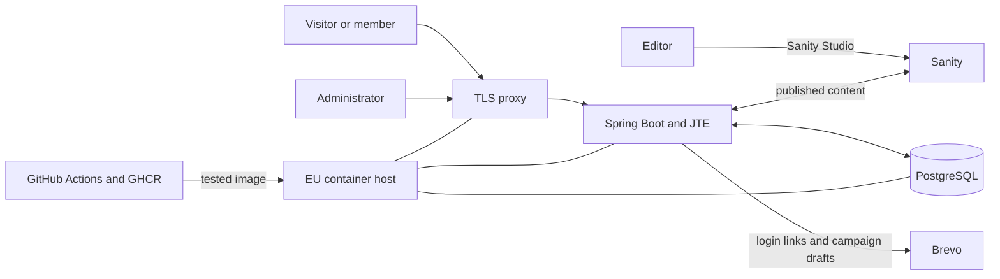

# Teater i Huskvarna, system plan

This file is the committed baseline for version 1. The customer's document is preserved in [projektplan-original.md](projektplan-original.md), with a translation in [projektplan-original.en.md](projektplan-original.en.md). Its technical sketch was a proposal. The project reviewed that proposal, and the accepted choices are recorded in [decisions/](decisions/).

[requirements.md](requirements.md) tracks the feature requirements. The next meeting's document under [meetings/](meetings/) holds the questions for the association, and [open-questions.md](open-questions.md) the ones that cannot be asked there. [GLOSSARY.md](../GLOSSARY.md) defines the project terms. This plan states the result, the system rules and the release conditions. It leaves detailed reasoning in the decision records.

## The system replaces private inboxes as well as the old website

The WordPress site is stale, but the larger problem is that annual meeting registrations, discounted ticket requests, volunteer coordination and membership records pass through private email accounts and phone numbers. Fees arrive by bankgiro and an administrator matches them to members by hand.

Version 1 must let the association:

- publish current information without a developer;
- contact members without a private address book;
- manage membership information in accounts the association controls.

## Seven checks define the intended result

| Result | Check |
| --- | --- |
| A non-technical editor publishes an event in under 10 minutes | Time a real editor who has not used the system before |
| An administrator sends a mailing to all paying members in under 5 minutes | Time from admin login to Brevo's send confirmation |
| The public site contains no private email address or phone number | Crawl rendered pages for the board's known private contact details |
| The register survives one person leaving | A second named board member signs in to every production account |
| A new developer runs the site within one hour of cloning it | Time the documented setup on a machine that has not built the project |
| Published content appears within one minute | Publish in Sanity and measure until the public page changes |
| The register survives loss of the host | Restore a production-format backup into an empty database and compare record counts |

## MUST requirements determine whether version 1 can launch

Version 1 must satisfy all 21 MUST requirements in [requirements.md](requirements.md). The three SHOULD requirements remain planned work but may be cut before a MUST requirement. The one COULD requirement comes last.

| Required for launch | Outside version 1 |
| --- | --- |
| Public news, events, association information, partners, productions, Ludde awards and contact pages | Payment by card or Swish on the site |
| Editing of all public content | A mobile app |
| Passwordless member login by email link | Ticket sales |
| Member contact details, fee status, offers and registrations | Member chat or forum |
| Member administration, family membership, manual fee marking and CSV export | Automatic bank reconciliation |
| Volunteer booking | |
| Mailings to selected member groups | SMS |
| Migration of relevant content from WordPress | More than one visitor language |

The [Swish research](research/swish-payments.md) examines automatic confirmation of membership fees as a possible scope change. It is research, not an accepted version 1 requirement.

Volunteer booking is a MUST requirement even though its row in the original, V1, says B, because the original's scope table lists it inside version 1. Where the customer's document contradicts itself, the scope table wins. [requirements.md](requirements.md) records the exception.

## Public content and member data stay in separate systems

Sanity holds public content. The Spring Boot application holds member data and renders the public site, member pages and administration pages with JTE. Every capability it has lives in an application service, which the JTE pages call in process and a REST API exposes over HTTP; the two must stay in step, and [0014](decisions/0014-one-service-layer-two-adapters.md) records how that is checked. PostgreSQL stores members, fees, registrations and volunteer bookings. Brevo sends login links and member mailings. The application, database and TLS proxy run as containers on one host in an EU region.

The development Compose stack also runs Sanity Studio; association editors use Sanity hosting, per [0021](decisions/0021-content-from-sanity.md). Both editors connect to Sanity's hosted content database. The development application reads the same `dev` dataset as Studio; automated tests use fixture content.

The application renders usable HTML on the server. Sanity content is cached, a publish webhook clears the cache, and the cache expires within one minute if the webhook fails.

The accepted component choices and their costs are recorded in [0004](decisions/0004-jte-for-templates.md), [0005](decisions/0005-brevo-campaign-drafts.md), [0006](decisions/0006-sanity-for-now.md), [0007](decisions/0007-postgres-in-a-container.md), [0008](decisions/0008-everything-in-containers.md) and [0009](decisions/0009-java-25-lts.md).

## Member login must not reveal membership

The member submits an email address and receives a short-lived, single-use login link if the address belongs to an account. The link works only in the browser that asked for it, and the mail carries a code for logging in when it is read on another device. The page gives the same response whether the address exists or not. Rate limits protect the request endpoint. Tokens live in PostgreSQL so deployment and process restarts do not invalidate them.

A login link is valid for one hour by default, and the lifetime is configurable. Tests must prove expiry, one-time use, that a link or code from another browser does not log in, and identical user-visible responses for known and unknown addresses. [0015](decisions/0015-login-links-on-spring-security.md) records why links are bound to a browser.

Members and administrators log in on separate pages, because one email address may belong to both an account and an administrator account, and each page looks the address up only among its own kind. A member login lasts 30 days and an administrator login 8 hours, since an administrator can read the whole register. The time counts from the login, not from the last use, so a stolen session cookie stops working on a known day. Two minutes before the end the page beeps, counts down and offers to start the full period again with one click. A login that ends leaves the page in place with a link to the login page. Each person's own page lists the devices they are logged in on, with a device name, when it logged in and when it was last used, and logs out one of them or all but the current one. The REST adapter accepts the same session cookie, with CSRF protection on changes, so both adapters authenticate the same way. Rate limits count recent requests per address and per IP address in PostgreSQL, next to the tokens, and the IP addresses are deleted along with expired tokens.

Members and administrators may also add passkeys on their own page and log in with one, which the requirement table does not ask for. A login link keeps working for everyone. The passkey login asks for no address, so it cannot reveal one either. [0016](decisions/0016-passkeys-beside-links.md) records the design.

The first administrator account comes from configuration at startup, when none exists. After that, administrators create and remove each other in the application, and nobody removes themselves: a last active administrator removing their own account would lock the association out. Removal is refused while two or fewer administrators remain, which is how the application enforces the two-administrator rule under [ownership](#ownership-and-maintenance-are-release-work) without refusing to start with one.

A membership application (R005) registers one person. The applicant gets a confirmation link, and the application becomes a member with an account when they follow it. An application nobody confirms is deleted after 24 hours. The page gives the same response when the address already belongs to an account; that account gets a mail pointing to the login page instead of a confirmation link, with no login link in it. The form therefore falls under the same rate limit as the login page. What R005 creates is provisional, see [open-questions.md](open-questions.md).

An invitation is valid for 7 days by default, and the lifetime is configurable. It is longer than an application's 24 hours because a logged-in member or an administrator sends it, so the bot argument does not apply, and the recipient may not read their mail for days. The sender can send it again.

## The application prepares mailings and Brevo sends them

An administrator selects an audience, the Brevo list or one of its segments, and chooses published Sanity content. The application builds the HTML and creates a draft Brevo campaign. The administrator reviews, test-sends and sends the campaign in Brevo. Brevo owns unsubscribe handling and campaign history. The application does not contain a second mailing editor.

Every member with an account is a contact on one Brevo list, updated on every change to the register, with attributes for the paid year, the latest volunteer shift and the offers registered for. The association builds its audiences as segments in Brevo, and a mailing goes to the list or to a segment: [decisions/0026](decisions/0026-outbox-and-brevo-contacts.md). The member register in PostgreSQL remains authoritative for membership and fee status, and Brevo for unsubscribes.

## The member model records only data the confirmed workflows need

The register stores name, phone, address and household for every member, and an email address for each account. A member added to a household has no account, and so no email address, until they accept an invitation sent by an administrator or by a member with an account in that household. Mailings therefore reach only members with an account. The register does not store a personal identity number. Development and test environments use invented data.

A member without a household can create one. The creator becomes its first owner. Only the current owner can rename it, add people, edit its members' contact details and remove other people, even when those people have accounts. Administrators can change ownership. Any member can leave; an owner first chooses a successor with an account, or administrators take over when no account holder remains. Removal preserves membership and login access; the existing fee rules determine coverage afterwards. Login email changes remain administrator-only. The user's 2026-09-30 and 2026-10-01 decisions are in [0025](decisions/0025-member-register-in-the-application.md).

The current fee rule is:

- one fee record belongs to one member account and one year;
- the fee kind is individual or household;
- an individual fee covers its member;
- a household fee covers every member in the payer's household;
- a member without a household has no household identifier;
- amounts use integer öre rather than a fixed 50 or 100 kr value;
- the record identifies the administrator who marked it paid.

Before building reconciliation, compare this rule with real anonymised bankgiro examples. A payer's name may differ from the covered member's name. If the examples break the rule, update the model and record the reason before implementation.

Offer registrations, volunteer bookings and mailing records refer to members by identifier. No member-register field may appear in a Sanity content type.

Offers and member documents live entirely in the application, because offer details are for members only and a Free Sanity dataset publishes everything: [decisions/0022](decisions/0022-offers-and-documents-in-the-application.md). Volunteer shifts live in PostgreSQL too and name the Sanity event they belong to: [decisions/0024](decisions/0024-volunteer-shifts.md).

## Accessibility needs automated and manual checks

The public site and member pages must meet WCAG 2.1 AA and work on a phone. CI runs an accessibility checker against rendered pages.

Swedish is the visitor and member language. English is used for code and project documentation under [0001](decisions/0001-language-policy.md).

## Security fails closed and backups must restore

- HTTPS is mandatory and HTTP redirects to it.
- Member and administrator routes deny access unless a rule grants it.
- Only administrators can read the member register.
- Login and mail endpoints have rate limits.
- Login tokens are short-lived, single-use and stored in PostgreSQL.
- The database is backed up daily to encrypted storage on another machine in an EU region.
- A restore into an empty database must succeed before launch.
- Container images use immutable commit tags so the deployed revision and rollback target are known.

Java 25 LTS and Spring Boot 4.1.1 are the committed runtime versions. GitHub Actions tests and builds the image. A successful build of `main` pushes the image to GHCR and deploys it over SSH.

## The association remains responsible for personal data

The member register lives in PostgreSQL and reaches Brevo only as required for login mail and mailings. Published names and photographs may live in Sanity, although the original says Sanity gets no personal data, because requirement R004's board and production pages cannot exist without them. Sanity's backend runs in three data centres in Belgium, and its [Data Processing Addendum](https://www.sanity.io/legal/dpa) binds it as processor as soon as the account is used, with standard contractual clauses for transfers ([security](https://www.sanity.io/security), [subprocessors](https://www.sanity.io/third-party-sub-processors)). The member register never goes there. How that content can still leave Belgium, including to AI providers in the US, is in [research/sanity-personal-data.md](research/sanity-personal-data.md). The association must document the purpose and lawful basis for each category of personal data, and the board is responsible for it ([first meeting](meetings/2026-09-24-meeting-1.md#personal-data)).

The association must have processor terms with each service that processes personal data on its behalf, including the host, Brevo and Sanity. It must also:

- restrict production access to named administrators;
- record the processing activities;
- decide and apply a retention period for former members and backups;
- handle photograph consent and removal requests, which the board does by hand ([first meeting](meetings/2026-09-24-meeting-1.md#personal-data));
- put an unsubscribe link in every member mailing and honour suppression in later mailings.

Sanity's Free plan exposes published documents, not drafts, through unauthenticated queries. Drafts require authentication. Offer descriptions and discount details are for members only ([first meeting](meetings/2026-09-24-meeting-1.md#what-the-site-does)), so they must stay outside a public dataset. Klas applies for [Sanity's nonprofit plan](https://www.sanity.io/docs/platform-management/non-profit-plan), which provides the Growth plan within quota at no charge for eligible organisations. Until approval, the Free plan and its public-dataset rules remain the fallback.

## Ownership and maintenance are release work

Production accounts belong to the association and use an association-controlled function address. At least two board members have administrator access. The temporary personal GitHub ownership is recorded in [0002](decisions/0002-accounts-under-a-personal-login.md) and must be revisited before more developers receive write access. The rules protecting main are in [0003](decisions/0003-no-branch-protection-yet.md).

The delivery includes:

- a runbook for deployment, update, rollback, backup and restore;
- short editor instructions for content and mailings;
- optionally, short screen recordings showing the same tasks. The original asks for recordings; written instructions are required and recordings are a COULD.
- an architecture description corrected to match the delivered system;
- a README that gets a new developer running within one hour.

A named person or company must accept maintenance responsibility by week 10. Dependabot and tests reduce routine work but do not replace an owner.

## A change is done only when its own evidence passes

A change is done when:

- tests cover its behavior and pass in CI;
- the behavior works in the deployed test environment and on a phone;
- affected documentation changes in the same commit;
- a product owner accepts visible behavior at a demo;
- no personal-data field appears without a documented purpose and retention rule.

[`docs/check.py`](check.py) verifies the copied requirement text, relative document links and Mermaid syntax. CI runs it with `--require-mermaid`.

## Week 12 ends with a usable system and a handover

The release is complete when:

- all 21 MUST requirements pass their acceptance checks;
- the site runs in production on the association's domain, in place of WordPress ([first meeting](meetings/2026-09-24-meeting-1.md#who-does-what));
- real editors have published real content;
- real administrators have marked a fee paid, exported the register and sent a mailing;
- the association owns every **production** account. Development and testing necessarily use accounts held by developers until an alternative is in effect;
- the automated accessibility check passes;
- a production-format database backup has been restored successfully;
- the named maintainer has received the runbook and credentials.

SHOULD and COULD requirements are cut before any MUST requirement. No technical convenience may silently reduce a MUST requirement.

## Two unresolved items can still change implementation

- The board must set the retention period for former-member data and backups.
- A maintainer and the association-owned service accounts must exist before launch.

The remaining questions are in the next meeting's document under [meetings/](meetings/) and in [open-questions.md](open-questions.md).
