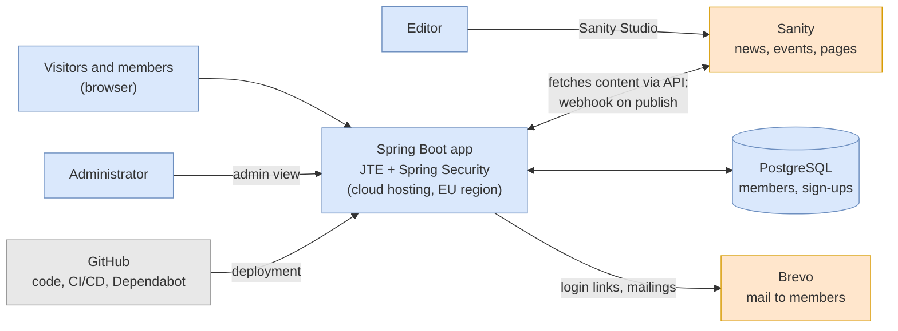
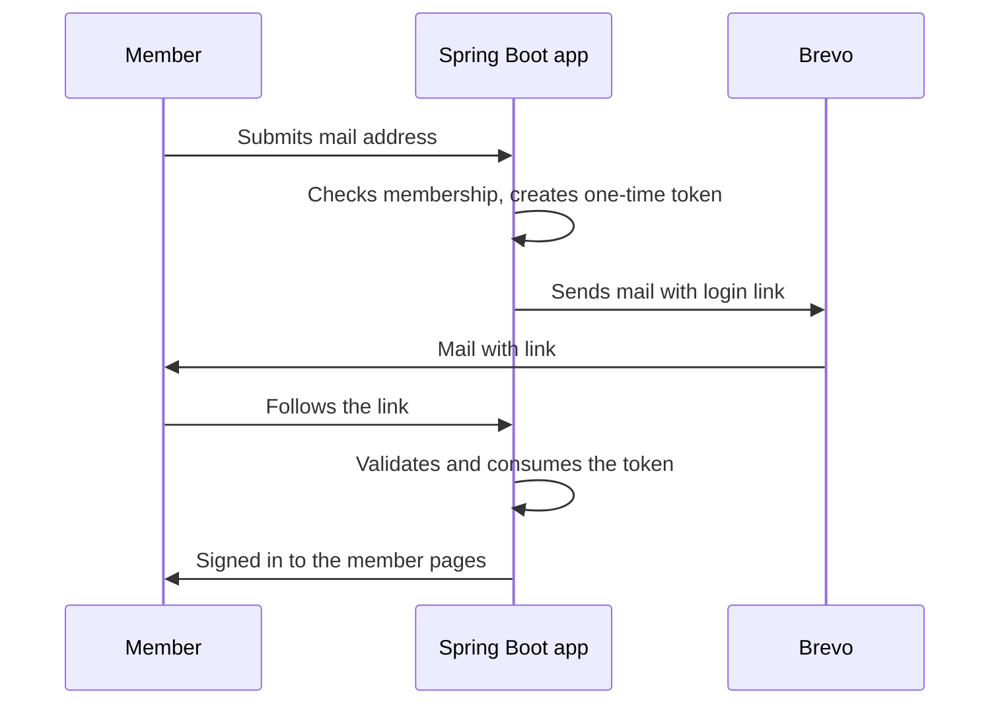
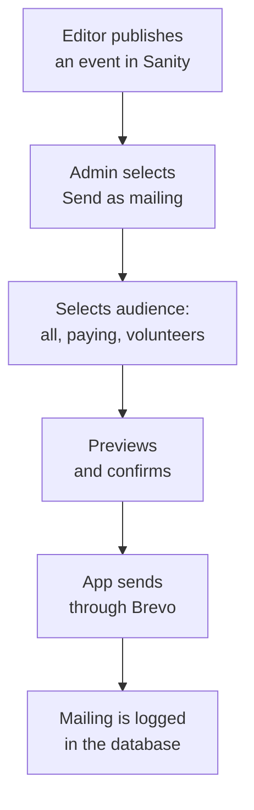
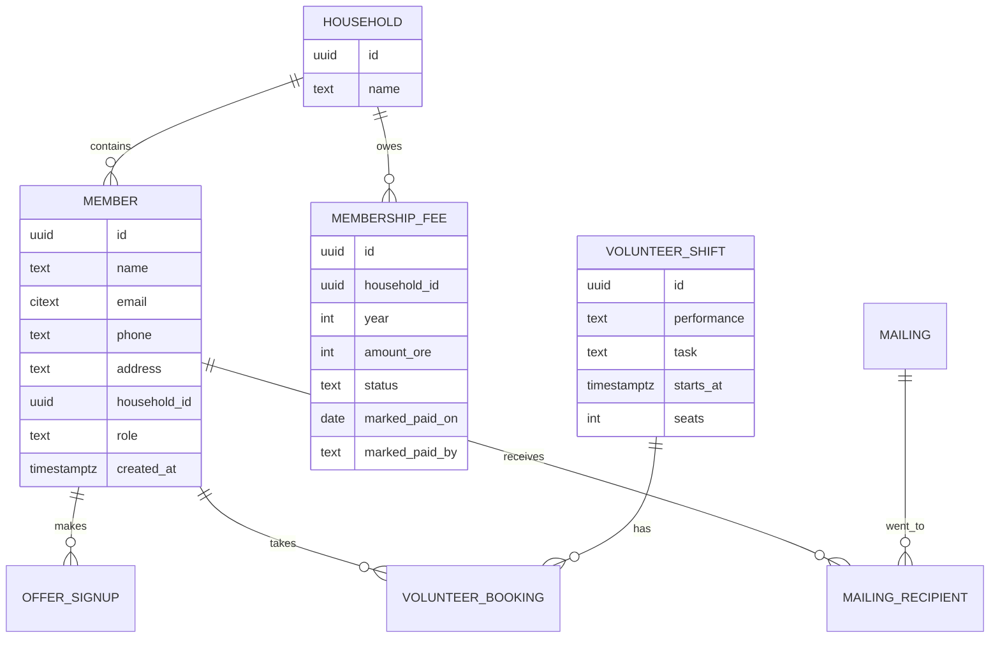

# Teater i Huskvarna, system specification

2026-09-22

What the new teaterihuskvarna.se has to be, and how anyone can tell whether it is. The produktägare's own document is [projektplan-original.md](projektplan-original.md), translated in [projektplan-original.en.md](projektplan-original.en.md); both are frozen and this file does not replace them. Where the two disagree, the difference is stated here rather than quietly resolved.

This is a specification, not a work plan. It says what has to exist and what counts as finished. It does not divide anything into tasks or assign anyone to them. The requirement list lives in [requirements.md](requirements.md), unanswered board questions in [open-questions.md](open-questions.md), and the reasoning behind individual technical choices in [decisions/](decisions/).

## Purpose

The association's site runs on WordPress and its newest article is from spring 2025. That is the visible symptom. The real problem is that member administration runs through board members' private Gmail and Hotmail accounts: annual meeting sign-ups, discounted ticket requests, and revue volunteers who tick off performances and mail a private individual. Membership fees, 50 kr single and 100 kr family, arrive by bankgiro with a name in the message field and get reconciled by hand.

So the system replaces a filing method, not a website. Three things have to become true:

- Publishing an event stops requiring a developer.
- Reaching every member stops requiring someone's personal address book.
- Knowing who is a member stops living in one person's inbox.

The last one is the reason this is worth building. A board member who resigns currently takes part of the membership register with them.

## Desired results

These are the outcomes the finished system is judged against. Each one is checkable by watching someone do it, not by reading code.

| Result | How it is checked |
| --- | --- |
| An editor with no technical background publishes an event in under 10 minutes | Timed, with a real board member who has not seen the system before, on their own laptop |
| A mailing to all paying members goes out in under 5 minutes | Timed, from admin login to send confirmation |
| No private mail address or phone number remains on the public site | `grep` the rendered site for the board's personal addresses, expect zero hits |
| The membership register survives any one person leaving | Two named board members hold admin on every account, checked by logging in as the second one |
| A new developer goes from clone to running site in under an hour | Timed on a machine that has never built the project |
| Published content appears on the site within a minute | Publish in Sanity, reload, measure |

The first and third are the ones that fail quietly. An editor who finds publishing awkward goes back to mailing the webmaster, and the site is stale again within a year.

## Scope

Version 1 is in production at the end of week 12, with the public site, editing, member login and mailings working. Everything else is later.

| In version 1 | Not in version 1 |
| --- | --- |
| Public site with news, events, association info, partners, Ludde awards | Payment by Swish or card on the site |
| All public content editable in Sanity | A mobile app |
| Passwordless member login by mail link | Ticket sales, which stay with Nortic and Tickster |
| Member pages with offers and sign-up | Member chat or forum |
| Volunteer booking for cloakroom and serving | Automatic reconciliation against the bank |
| Admin view for the member register and manual fee marking | SMS |
| Mail to selected groups of members | More than one language |
| Migration of the content worth keeping from the current site | |

Payment deserves a note, because it looks like an omission. Fees stay on bankgiro and an administrator ticks them off by hand (requirement A2). Adding Swish means handling money, which means a payment provider agreement, reconciliation rules, and refunds. For an association collecting 50 kr from a few hundred people, the manual tick is not a compromise, it is the correct amount of machinery.

## Architecture

Two systems. Sanity holds public content. The Spring Boot application holds everything about people. No personal data is ever written to Sanity, which is what keeps the GDPR question confined to one database and one mail provider.

The application renders every page server-side. There is no separate JavaScript front end, and no page requires JavaScript to read or to submit a form. That is a hard constraint, not a preference: it is what makes WCAG 2.1 AA achievable by a small team, and it removes an entire second build from the maintenance bill.

The site reads Sanity through its API and caches the result. A webhook on publish clears the cache, which is how R2 gets met. If the webhook fails, the cache expires on its own within a minute, so a broken webhook degrades to a one-minute delay rather than a stale site.

### Components

| Component | Responsibility | Built or configured |
| --- | --- | --- |
| Sanity Studio | Editing public content | Content models configured in TypeScript |
| Spring Boot app | Renders the site, member area, admin view | Built |
| JTE templates | HTML for every page | Built. See [decisions/0004](decisions/0004-jte-for-templates.md) |
| Spring Security one-time token | Passwordless login | Configured; the mail sending around it is built |
| PostgreSQL | Members, sign-ups, volunteer shifts | Schema built, migrations under Flyway |
| Brevo | Delivers login links and mailings | Integration built |
| GitHub Actions | Tests, build, deployment | Configured |
| Dependabot | Dependency update proposals | Configured |

### Member login

Three properties this flow has to keep, all of them testable:

- A token works once and then never again.
- A token expires shortly after it is issued. Ten minutes unless the board wants otherwise.
- An unknown address gets exactly the same response as a known one, with the same timing. Otherwise the login form becomes a way to ask whether a given person is a member.

The third is the one that gets broken by accident, usually by an error message added later for helpfulness.

### Mailings

The mailing takes its text from the Sanity document, so the wording is written once. Every mailing carries an unsubscribe link (U3), and the send step cannot be reached without passing through the preview (U2).

## Data

Personal data lives only in PostgreSQL. The schema sketch below is the specification for what gets stored; anything not on it needs a reason before being added.

Offers, sign-ups and mailings are sketched by their relationships rather than their columns, because their fields follow from the requirements (M3, A3, U1, U4) and do not carry decisions worth arguing about here.

Four rules about this data:

- **No personnummer.** Name, mail, phone, address and household are enough. This is enforced by a test that fails if a column named `personnummer`, `national_id` or `ssn` appears in the schema, not by a sentence in a document.
- The fee is owed by a household for a year, not by a person. Every member belongs to a household, including a household of one, so a 50 kr single and a 100 kr family membership are the same row with a different `amount_ore`. Hanging the fee off the member instead forces a rule about which family member counts as having paid.
- Money is stored in öre as an integer. Fees are decided by the annual meeting and will not stay 50 and 100 kr forever.
- `marked_paid_by` records which administrator ticked a fee off. Manual reconciliation without an audit trail is how disputes become unresolvable.
- Personal data never leaves for Sanity. Sanity gets no member fields, not even a name on a volunteer shift.

## Accessibility and the public site

WCAG 2.1 AA (P6) is a requirement, and it is the one most likely to be declared done without being done. So it gets a mechanical check in the build: `@axe-core/cli` 4.13.0 or `pa11y-ci` 4.1.1 run against the rendered pages in CI, failing the build on violations.

An automated checker catches perhaps a third of WCAG failures. It cannot tell whether alt text is accurate, whether the focus order makes sense, or whether a colour combination is readable to the person actually reading it. So the automated check is a floor, and the rest is a manual pass: keyboard-only navigation of every page, and one run through with a screen reader. That manual pass has no mechanical substitute and the plan does not pretend otherwise.

The site works on a phone. Given the association's audience this is not a secondary consideration, and the layout is designed narrow-first rather than shrunk down afterwards.

## Language

Swedish is what a visitor or member reads. English is everything else, including this document, the code, and the commit messages. The full rule and its two exceptions are in [decisions/0001](decisions/0001-language-policy.md).

Swedish visitor-facing text lives in `messages_sv.properties` and in Sanity, not inside templates. A template holds markup and references a message key. This keeps the copy in one place a non-developer can be pointed at, and it means correcting a typo in a validation message does not require touching a template file.

## Security

- HTTPS everywhere, with HTTP redirected.
- One-time login tokens, short-lived, stored in the database rather than in memory. In-memory tokens break the moment there is more than one instance, and they vanish on every deploy.
- Rate limiting on the login form and on the mail-sending endpoints.
- Two roles, member and administrator (I2). The member register is visible only to administrators.
- The default for a new route under `/medlem/**` or `/admin/**` is denied. Access is granted per route, never assumed.
- Daily database backups, with a restore that has actually been performed once. An untested backup is a guess.

## Personal data

The association becomes data controller for the member register and has to be able to show how the data is protected.

- Data processing agreements with Brevo and the hosting provider, which both process member data. Sanity gets none, so it needs none.
- Database and hosting in an EU region.
- Development runs against invented test data. Production data never reaches a development machine.
- Members who have not renewed are anonymised or deleted after a period the board sets. That period is an open question and the retention job cannot be written until it is answered.
- Member mailings go out on the basis of membership. Every mailing carries an unsubscribe link.
- A short record of processing activities is written as part of the documentation.

## Operations

GitHub holds the code, runs the tests on every push and pull request, and deploys. Dependabot proposes dependency updates weekly. Together those mean routine maintenance is approving a green pull request rather than remembering to check for updates.

Hosting is a cloud provider with an EU region and a managed PostgreSQL service. The original plan assumes Azure on the strength of Microsoft's nonprofit credit of 2 000 USD a year. That credit is not yet applied for and does not roll over, so the choice stays open. Nothing in this specification depends on which provider wins.

Java 26 and Spring Boot 4.1.1. Java 26 is not an LTS release and its updates end around September 2026, which is a real cost against a system whose maintenance budget is a few hours a year. It was chosen deliberately anyway, with Java 25 LTS one line away if the handover argues otherwise.

## Quality bar

The association gets one build. After week 12 the budget is a few hours a year, so anything that needs regular attention will not get it. That pushes every choice towards fewer moving parts and towards checks that run without being remembered.

A change is finished when all of these hold:

- Tests exist for it and pass in CI.
- The tests can fail for the reason they claim to. A check nobody has watched fail is not evidence. Where a property cannot be checked mechanically, the specification says so instead of implying coverage.
- It works in the deployed test environment, including on a phone.
- The documentation that describes it is updated in the same change.
- No new personal data field appeared without being on the list above.

Four documents ship with the system: how to deploy, update and restore it; how to publish content, as short screen recordings; what the architecture actually became, as opposed to what this file predicted; and a README that gets a new developer running in under an hour.

## What has to be true at week 12

Twelve weeks, ending with version 1 in production. No milestone breakdown here, because a specification that also schedules itself goes stale twice as fast. The end state:

- Every Must requirement in [requirements.md](requirements.md) is done, 20 of them.
- The site is live on the association's domain, or the cutover from WordPress is a decision the board has consciously deferred.
- Real editors, not the developers, have published real content.
- Real administrators have marked a fee paid, exported the register, and sent a mailing.
- All accounts are owned by the association, or every exception is written down in [decisions/](decisions/) with what it costs to undo.
- The accessibility check runs in CI and the manual keyboard and screen-reader pass is done.
- A backup has been restored successfully at least once.

If something has to be cut, Should and Could requirements go first, in that order. That rule comes from the produktägare's own document and is the reason the priority column exists.

## Risks

The largest risk is that nobody owns the system after week 12. Everything else is smaller than that.

| Risk | Likelihood | Impact | Response |
| --- | --- | --- | --- |
| No maintainer after handover | Medium | High | Named maintainer before launch; the automation above keeps routine updates to approving a pull request |
| Scope overruns and version 1 misses week 12 | High | High | Strict priority; Should and Could cut first |
| Accessibility declared done on the automated check alone | Medium | High | The manual pass is a separate named item in the week 12 list |
| Sanity changes its free tier | Low | Medium | Content exports; budget for a paid plan |
| More than 300 members hits Brevo's daily limit | Unknown | Low | Member count is an open question; split the send or upgrade |
| Azure credit is not granted | Unknown | Medium | Apply early; nothing here depends on the provider |
| Personal data leaks from a development environment | Low | High | Test data only; production access restricted |
| Editors find it awkward and stop using it | Medium | High | Timed test with real editors is a desired result, not an afterthought |

The produktägare's version of this table lists two risks this one drops, both about a team that no longer applies: mentoring that does not materialise, and four junior developers taking on too much.

## Decisions this specification assumes

Recorded, with reasoning, in [decisions/](decisions/):

- [0001](decisions/0001-language-policy.md), Swedish for readers, English for everything else.
- [0002](decisions/0002-accounts-under-a-personal-login.md), why the repository sits on a personal account and what a transfer costs.
- [0003](decisions/0003-no-branch-protection-yet.md), why main carries no protection rules yet.
- [0004](decisions/0004-jte-for-templates.md), JTE rather than Thymeleaf.

Assumed here but not yet recorded, each one worth a decision record before it is built:

- Rich text from Sanity as Markdown rendered by commonmark-java, rather than Portable Text. No Java Portable Text renderer exists on Maven Central, so Portable Text means writing one. This trades Sanity's visual block editor for zero custom rendering code, and it affects what editors see, so it is a content decision rather than a technical one.
- Brevo over SMTP rather than its API. SMTP means `JavaMailSender` with one configuration locally against Mailpit and another in production, which is less code than an API client and testable without mocking. The original document says API.
- One repository holding both the application and the studio, so a schema change and the template reading it land in the same commit.
