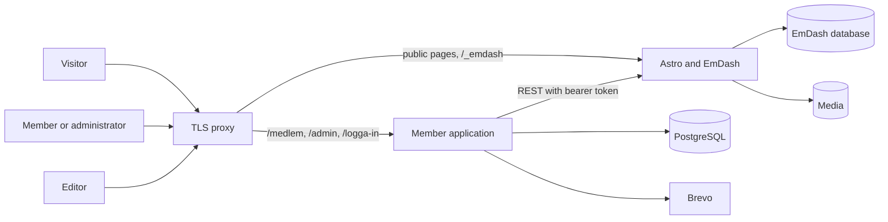

# EmDash 1.0 instead of Sanity

Researched on 2026-09-29 against EmDash's docs and source at commit `3c11cfb` of [emdash-cms/emdash](https://github.com/emdash-cms/emdash). Nothing was installed or run. Claims marked "not verified" were not settled either way.

The user asked for EmDash to be judged the native way: EmDash and Astro render the public site, rather than EmDash serving a Java site as a headless CMS. An earlier version of this document assumed headless and missed most of what EmDash offers.

## TL;DR

- Native EmDash means an Astro application renders the public pages and runs the admin panel and the content database in the same process. Two ways to adopt it are compared: EmDash for public content with a separate member application (split), or the whole system inside EmDash (all-in). The comparison ignores code already written and measures against the produktägare's plan.
- EmDash covers the public site and editing natively. That is R001 to R004, R007 to R009, and the WordPress migration, which is in version 1's scope. Preview and click-to-edit, which Sanity cannot give a server-rendered site in another language ([0006](../decisions/0006-sanity-for-now.md)), come built in.
- For the member side, EmDash has six gaps with no supported way through. Plugins cannot create, change or delete users. No user can be deleted at all. Every uploaded file is public. No transaction spans two records. Roles are a fixed ladder of five. The magic link lands members in the CMS admin after 15 minutes at most. See [What EmDash is missing](#what-emdash-is-missing-from-first-principles).
- The rest of the member side (mailings, shifts, exports, member pages) has no EmDash feature behind it but has a supported place to build it: native plugins, editor panels, `cron` and Astro pages.
- The plan staffs the build and the maintenance with Java-track students, and all-in EmDash has no Java.
- The agent's view is that the plan's own split, public content in a CMS and members in their own application, is also the right split by design, and EmDash fits the CMS half well. A one-day spike (the real WordPress import, and two pages in the old design) would decide between EmDash and Sanity for that half. See [Agent assessment](#agent-assessment).

## What was released

Cloudflare announced EmDash on 2026-04-01 as "the spiritual successor to WordPress" and released 1.0 on 2026-09-28 ([Cloudflare blog](https://blog.cloudflare.com/emdash-cms-plugin-registry/), [EmDash blog](https://emdashcms.com/blog/emdash-1-0)). It is MIT licensed. The repository had 13,033 stars and 311 open issues on 2026-09-29. Cloudflare says its own blog has run on EmDash since August. From 1.0 on, "breaking changes ship only in a new major version" ([Technobezz](https://www.technobezz.com/news/emdash-1-0-free-open-source-cms-plugin-registry)).

It runs on Node 22.16 or later, or on Cloudflare Workers. On Node it uses SQLite, libSQL or PostgreSQL, and local disk or S3-compatible storage for media ([Deploy to Node.js](https://docs.emdashcms.com/deployment/nodejs/), [Database Options](https://docs.emdashcms.com/deployment/database/)).

## What native means

[Architecture](https://docs.emdashcms.com/concepts/architecture/): "EmDash runs inside an Astro application. The public pages and the admin panel share the EmDash runtime, database, and media storage." Pages are `.astro` files that call `getEmDashCollection()` and `getEmDashEntry()` in process, with no HTTP request and no cache of their own. A server-rendered page reads current content on every request, so R008's minute holds with no webhook and no cache to expire.

What comes with it, each from EmDash's own docs:

- **Preview.** A signed `_preview` link shows the draft through the same template. The admin's "View on site" creates it ([Preview Mode](https://docs.emdashcms.com/guides/preview/)).
- **Click-to-edit.** Spreading `{...entry.edit}` on an element adds `data-emdash-ref` attributes. An editor who is logged in gets a toolbar and edits on the page. For everyone else the attributes produce no output.
- **Portable Text rendering.** `<PortableText value={...} />` from `emdash/ui`, plus Astro components for images, galleries, embeds and tables. The Java renderer, [`PortableText.java`](../../src/main/java/se/teaterihuskvarna/content/PortableText.java), would not be needed.
- **WordPress import.** From a WXR export or the EmDash Exporter plugin, including media, menus, taxonomies and URL rewriting ([Migrate from WordPress](https://docs.emdashcms.com/migration/from-wordpress/)). The old site at [teaterihuskvarna.se](https://teaterihuskvarna.se/) is WordPress ([design/old-site](../../design/old-site/README.md)).
- **Menus, taxonomies, relations, SEO fields, site search, redirects and scheduled publishing.** All listed in [the docs index](https://docs.emdashcms.com/llms.txt) and the [REST API reference](https://docs.emdashcms.com/reference/rest-api/).
- **Roles.** Subscriber, Contributor, Author, Editor and Admin, with no seat limit, and logins by passkey or magic link ([Authentication](https://docs.emdashcms.com/guides/authentication/)).

## Requirements against native EmDash

| Id | Requirement, short | Native EmDash | Custom code needed |
| --- | --- | --- | --- |
| R001 | Next event first on the start page | Query in an Astro page | One page |
| R002 | Calendar filtered by series | Relation or taxonomy | One page |
| R003 | News list and news page | Collection | Two pages |
| R004 | Association pages | Collection, menus | One template |
| R005 | Membership form | No | Member register |
| R006 | Mobile, WCAG 2.1 AA | Depends on the templates written | The templates |
| R007 | Content types | Collections, defined in the admin or a seed file | None |
| R008 | Visible within a minute | Live reads, nothing to expire | None |
| R009 | Preview | Preview links and click-to-edit | None |
| R010 | Passwordless login | Magic link and passkey, for admin-panel users | Member login, see below |
| R011 | Member and administrator roles | Five CMS roles | Member side |
| R012 to R015 | Member pages | No | All |
| R016, R017 | Volunteer shifts and reminders | Plugin `cron` hook exists | All |
| R018 to R021 | Member administration, export | No | All |
| R022 to R025 | Mailings through Brevo | No | All; the content comes from EmDash |

The [`forms`](https://github.com/emdash-cms/emdash/tree/main/packages/plugins/forms) plugin handles public forms, but R005 creates a member with a payment status, which is register logic rather than a form submission.

## Other findings

- **Maturity.** 1.0 was released on 2026-09-28 and 1.0.1 followed within a day. The project is six months old.
- **The Swedish admin.** `packages/admin/src/locales/sv/messages.po` has 1,351 empty translations out of 3,079 strings, so 56% is translated. German has 21 empty. Editors would see Swedish and English mixed until the rest is translated, which the project could contribute.
- **The content model lives in the database.** Administrators create collections and fields in the admin panel, and EmDash alters the tables to match. A seed file "applies only when the database has no collections". `emdash types` generates TypeScript declarations from a running instance ([CLI](https://docs.emdashcms.com/reference/cli/)), so a removed field breaks the Astro build, but only if the build runs against the production model. Not verified how that is meant to work in CI.
- **Personal data** stays on the association's host. [research/sanity-personal-data.md](sanity-personal-data.md) stops applying, and question S1 in [open-questions.md](../open-questions.md) goes away.

## What EmDash is missing, from first principles

This section ignores the Java already written and measures EmDash against the produktägare's plan ([projektplan-original.en.md](../projektplan-original.en.md)) and against what a member register needs to be well designed. The question is all-in: can EmDash, with native plugins and Astro pages, be the whole system?

Each gap below comes from EmDash's source at `3c11cfb`, unless it names a doc.

### Gaps with no supported way through

1. **Plugins cannot create, change or delete users.** `UserAccess` in `packages/core/src/plugins/types.ts` has `get`, `getByEmail` and `list`, and nothing else. EmDash's self-signup works only for email domains an administrator has allowed (`packages/auth/src/signup.ts`), and members use Gmail and Hotmail addresses. The join form (P5) and "add and delete members" (A1) therefore cannot make members EmDash users through any supported API. The workaround is importing `@emdash-cms/auth/adapters/kysely` directly, as EmDash's own snapshot route does. That is an internal package, so it can break on any minor release.
2. **Users cannot be deleted.** The admin routes under `astro/routes/api/admin/users/` disable and enable users and nothing more. The auth adapter has a `deleteUser`, but no route calls it. The plan's cleanup rule, that members who have not renewed "are anonymised or deleted", and the delete in A1 have nowhere to go.
3. **Every uploaded file is public.** `/_emdash/api/media/file/` is in the unauthenticated list, and the route refuses only backup and transfer keys. Annual meeting documents and member letters (M4) are for members only, and they would be readable by anyone who has the link. They need storage and a download route of their own.
4. **No transaction spans two records.** Plugin storage is a document store with indexed queries, unique indexes and `updateIf()` on one document. "Atomicity covers a single key", and "writing two plugin records" are "separate operations" ([Storage](https://docs.emdashcms.com/plugins/creating-plugins/storage/)). Signing up with seats left (M3) can be done with one counter document, but the sign-up record and the counter can drift apart if the second write fails. A household fee that covers several members (A2) is several records by nature. A register with foreign keys and constraints between members, households, fees and sign-ups does not fit that model. A native plugin can open its own PostgreSQL connection and own its tables, but then EmDash's migrations, [backups](https://docs.emdashcms.com/guides/backups/) and site transfer do not know about them.
5. **Roles are a fixed ladder of five.** `packages/auth/src/rbac.ts` maps each permission to a minimum role, from Subscriber to Admin, and a plugin cannot add a role. Reading the member register would need Admin, and Admin also changes the content schema, the site settings, the users and the plugins. The board cannot have an administrator who handles members but cannot touch the site's structure, or an editor who sees the list of volunteers.
6. **Member login lands in the CMS.** The magic-link mail points at `/_emdash/api/auth/magic-link/verify`, which redirects to `/_emdash/admin/login/magic-link`. The send route passes no redirect, so a member ends up on the admin panel's confirmation page and then on its dashboard. The plan says "logged in to the member pages". The link's lifetime is a constant, 15 minutes (`TOKEN_EXPIRY_MS` in `packages/auth/src/magic-link/index.ts`). Sessions last 30 days for every role, set once for the whole site (`session.maxAge` in `packages/auth/src/config.ts`). A session that can read the whole register cannot be made shorter than a member's.

### Gaps that are just features to build

These have no EmDash feature behind them, but EmDash offers somewhere supported to put the code.

- **Mailings (U1 to U4).** EmDash sends one transactional message at a time through a provider plugin. The community [`emdash-smtp`](https://github.com/masonjames/emdash-smtp) package lists Brevo as a provider. Nothing in EmDash chooses an audience from the register, builds a campaign, or keeps a log. The only newsletter plugin in the registry, `bulletin` 0.1.1, keeps its own subscriber list with double opt-in, which is a different model from "all members, paying members, volunteers". A native plugin can add an editor panel to an event's sidebar ([React admin](https://docs.emdashcms.com/plugins/creating-native-plugins/react-admin/)). That matches the plan's flow, where an editor publishes an event and an administrator picks "send as mailing", better than anything Sanity offers.
- **Volunteer shifts (V1) and reminders (V2).** Nothing exists. Plugins get a `cron` hook, evaluated in UTC, which runs only while a Node process is up ([Deploy to Node.js](https://docs.emdashcms.com/deployment/nodejs/)).
- **CSV export (A3, A4).** Nothing exists. A plugin route or an Astro endpoint can produce it.
- **Member pages (M1 to M4) and the admin view (A1 to A4).** Astro pages can read the logged-in user from `Astro.locals.user`, which EmDash's middleware sets on public routes without blocking them (`handlePublicRouteAuth` in `packages/core/src/astro/middleware/auth.ts`). Admin views can be plugin pages inside the EmDash admin.
- **Plugins.** The registry had 23 packages on 2026-09-29, from `https://registry.emdashcms.com`. None handles members, Brevo campaigns or bookings. The event plugin `eventual` keeps events in its own storage instead of as content, so it would compete with the content model rather than serve it.

### What EmDash does give the member side

- The magic-link request returns the same response for unknown addresses, with a random 100 to 250 ms delay standing in for the work of a real send (`sendMagicLink`). The login, signup and OAuth endpoints are rate-limited per IP address ([Authentication](https://docs.emdashcms.com/guides/authentication/)).
- Passkeys, and auth mails localised by the site's locale (`resolveEmailLocale` in the send route). Whether the Swedish strings for the auth mail are among the translated half is not verified.
- A Subscriber role that "can read published content" and not drafts, meant for member-only content.
- Plugin storage with unique indexes and `updateIf()`, the `cron` hook, the email pipeline, admin pages and editor panels, and a Vitest harness for plugins, [`@emdash-cms/plugin-test`](https://github.com/emdash-cms/emdash/tree/main/packages/plugin-test).
- One process, one database and one layout. The split's seams, a layout kept twice and public pages that cannot see the login, do not exist.

### Customer constraints that EmDash cannot change

These are in the produktägare's plan, not in any code already written.

- **The developers are "Lexicon students, Java track"**, and the first-choice maintainer is "the next APL cohort from Lexicon's Java track". The plan chose Spring Boot as "the students' training language". It accepts that "the students write a little JavaScript" for Sanity Studio. All-in EmDash has no Java at all.
- **"Little custom code on top of proven parts."** For the public site, EmDash removes custom code: the renderer, the preview protocol, the cache and the webhook. For the member side it removes almost none. Gaps 1 to 6 are the parts where custom code would sit on top of a product released on 2026-09-28, instead of on Spring Security's one-time tokens and PostgreSQL.
- **"No CMS server to keep updated"** was the plan's reason for Sanity. Any EmDash option puts a CMS server on the association's host.

## The split, for comparison

In the split, EmDash owns public content and a separate member application owns the register, login, offers, member documents, shifts and mailings. That is the plan's own division, with EmDash in Sanity's place. What it costs:

- **The layout exists twice**, in Astro and in the member application's templates, unless both use one stylesheet and the same markup.
- **Public pages cannot see the member login.** A "Mina sidor" link that changes after login needs a cookie that Astro can read, or it stays static.
- **Mailings and shifts reach across.** A mailing builds HTML from an event, and a shift names the event it belongs to. The member application reads both over EmDash's REST API with a token, and renders Portable Text for mail itself.
- **Two stacks** to build, test, update and host.

## Agent assessment

Written by an agent. Nothing below is decided.

Measured against the customer's plan and not against any code, EmDash splits along the same line the plan already draws: "Sanity for public content, and a Spring Boot app for everything that concerns members". On the public side, EmDash covers everything Sanity covers and adds preview, click-to-edit, a WordPress import and private content, with less custom code. On the member side, its user model is built for the people who edit the site. Gaps 1, 2, 3 and 6 are about who a member is, and gaps 4 and 5 are about how the register is stored and who may read it. A well-designed register is relational, transactional, and readable only by the people the board appoints. It would be its own model with its own tables in any language. So the boundary between the two parts follows from good design, and not only from the Java already written.

Once the register is its own model, all-in EmDash means a TypeScript application running inside EmDash's process that uses EmDash for little beyond sessions. That login still lands in the admin panel and cannot delete a user. What all-in really gains is one process, one layout and one login, and the plan's Java-track staffing counts against it. The agent recommends the split over all-in, with the same spike as before (import the real WordPress site, build two pages in the old design) to decide between the split and staying on Sanity.

Where all-in would win: if the next APL cohort were not Java students, or if one login across public and member pages mattered more than the gaps above. Both are the produktägare's to say, not the agent's.
