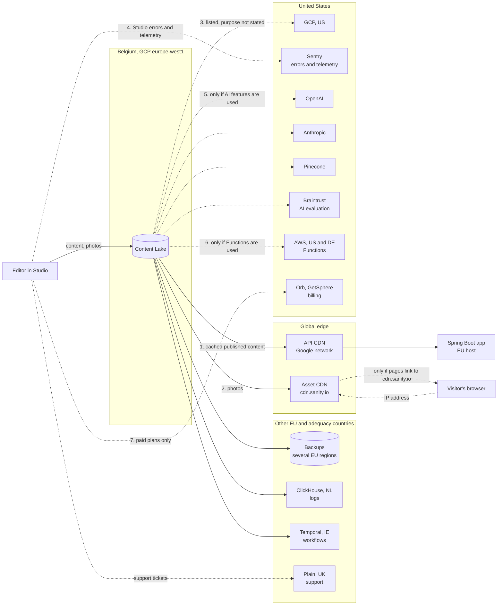

# Personal data in Sanity, and where it can end up

Researched against Sanity's own legal and documentation pages on 2026-09-23. They change, and the subprocessor list changed as recently as 2026-01-19, so re-read the sources before relying on a detail here.

## TL;DR

- Sanity will hold personal data. Requirement R004 puts names and photographs of board members and performers, children included, in Sanity, although the original says "Sanity får inga personuppgifter". The member register stays out.
- The data is stored in Belgium today, but the DPA lets Sanity process it "in any country where Sanity or its Subprocessors operate". Whether the association contracts with the US or the Norwegian Sanity entity is not verified.
- Data leaves Belgium by default through the API CDN, which caches published content worldwide, and through photographs, which are public URLs even in a private dataset. Linking `cdn.sanity.io` from the site sends every visitor's IP address to Sanity.
- Studio errors and telemetry go to Sentry in the US. Opting out is per developer and per editor.
- AI features send content to OpenAI, Anthropic, Pinecone and Google. The nonprofit plan the project is applying for is what makes AI Assist available.
- Sanity can add a subprocessor by editing a web page. It counts as approved unless someone objects within ten days.
- Two options do the most. Proxying photographs through the application keeps visitors' IP addresses away from Sanity. Forbidding AI plugins in the Studio config closes the AI route. Nothing is decided yet.

## Sanity will hold personal data, and the original said it would not

The produktägare's document says "Personuppgifter lagras bara i appens egen databas, aldrig i Sanity" and "Sanity får inga personuppgifter".[^original] Requirement R004 contradicts that. The board page and the production pages show names and photographs of identifiable people, and news items name people too. The plan keeps Sanity for that content and keeps the member register out of it ([projektplan.md](../projektplan.md), [0006](../decisions/0006-sanity-for-now.md)).

What Sanity would hold for this site:

- Names, roles and photographs of board members, performers and volunteers, in published documents.
- People named or pictured in news items and production pages, children in productions included.
- Editors' accounts: name, email, login provider, and whatever Sanity logs about their sessions.
- Whatever an editor types or uploads by mistake. Nothing in Sanity stops an editor pasting a private phone number into a news item. The old site did exactly that, which is why the screenshots in [design/old-site](../../design/old-site/README.md) are redacted.

The member register (addresses, phone numbers, fee status, household) never goes to Sanity. That line still holds and is the reason Sanity is acceptable at all.

## Sanity's storage is in Belgium, but its contract allows processing anywhere

The storage claim is true for today. Sanity's security page says:[^security]

- "backend systems currently run across three data centers in a single EU region (Belgium)"
- "Our databases are also continuously backed up to remote storage in multiple EU regions"
- "Files and assets are replicated across multiple EU regions as well"

The contract does not promise any of that. The Data Processing Addendum,[^dpa] dated 2026-08-12, says "Sanity may Process Personal Data in any country where Sanity or its Subprocessors operate". It covers transfers out of the EU with standard contractual clauses. It binds the association from the first use of the account ("CREATING AN ACCOUNT, OR ACCESSING OR USING THE SERVICES, SUBSCRIBER AGREES TO BE BOUND BY THIS DPA"). Nobody has to sign anything, which also means nobody has read it by default.

The DPA names two possible counterparties, Sanity US Inc. in San Francisco and Sanity AS in Oslo, and does not say which one a given customer gets. Which one the association contracts with is not verified. Neither is whether either entity is certified under the EU-US Data Privacy Framework. If the counterparty is the US company, US law enforcement can compel it directly. The DPA's clause on that only promises notice "unless legally prohibited".[^dpa]

## Seven ways data leaves Belgium

Solid arrows happen for any Sanity project. Dashed arrows depend on a feature, a plan or a choice this project makes. The numbers match the sections below. Every subprocessor and location comes from Sanity's subprocessor list.[^subprocessors]

### 1. The API CDN caches published documents worldwide

The security page says "For serving purposes, data may be stored transiently or cached in any country in which Google Cloud or its agents maintain facilities."[^security] A published board page with names on it is therefore cached outside the EU whenever someone reads it through `apicdn.sanity.io`. This data is already public on the site, so the privacy risk is small. It still means "stored in Belgium" is not the whole truth.

### 2. Photographs are public URLs, and linking to them sends visitors' IP addresses to Sanity

Sanity's documentation says "Asset files are not private, so even images uploaded to a private dataset can be viewed by unauthenticated users."[^safe] A private dataset on the nonprofit plan does not protect photographs. Anyone holding the URL can fetch them.

If the site's HTML points `` at `cdn.sanity.io`, every visitor's browser also contacts Sanity's CDN before consenting to anything. The old site did the same with Google Fonts, and [design/old-site](../../design/old-site/README.md) self-hosts the font for that reason. Deleted assets "may also remain in public CDN caches according to their configured expiry time",[^security] so a removal request for a photo is not complete when the editor deletes it.

### 3. Google Cloud in the US is listed, with no stated purpose

The subprocessor list gives Google Cloud Platform the locations "Belgium (Primary), United States" and the purpose "Platform hosting and AI (Gemini)".[^subprocessors] It does not say what goes to the US region. The Gemini part suggests AI features, which would be route 5.

### 4. Studio errors and telemetry go to Sentry in the US

Sentry is listed for "Error recording, notifications, tracking, and telemetry".[^subprocessors] Sanity's telemetry page lists what it collects: commands and events, errors "excluding sensitive data", version, plugins and the editor's Sanity user ID. Participation is optional, and `DO_NOT_TRACK=1` or `sanity telemetry disable` turns it off.[^telemetry] The page doesn't say whether telemetry is on unless someone opts out. Whether an error report can contain document content is not stated either.

### 5. AI features send content to OpenAI, Anthropic, Pinecone and Google

The AI terms[^tos-ai] list "OpenAI, L.L.C.", "Anthropic, PBC", "Pinecone Systems Inc." and Google. They say that "All configurations explicitly prohibit or disable such training activity on all data transferred to third party AI providers". They also say data "may be retained for a few days by our providers".[^tos-ai] Braintrust is listed for "AI quality evaluation",[^subprocessors] which suggests prompts or outputs reach it too.

Nothing flows here unless an AI feature is used. AI Assist needs the `@sanity/assist` plugin in the Studio config and a click on "Enable Sanity AI Assist". It is "available for all projects on the Growth plan and up".[^assist] The nonprofit plan the project is applying for mirrors Growth, so getting that plan is exactly what makes this route available. One editor asking AI Assist to "write a caption for this photo of the Ronja cast" would send the children's names to a US AI provider.

### 6. Functions run on AWS in the US and Germany

This applies only if the project writes Sanity Functions. The plan puts all logic in the Spring Boot application, so nothing is planned here.

### 7. Billing goes to Orb and GetSphere in the US

This applies only on paid plans, and it covers account data, not content. It is not relevant while the project is on Free or nonprofit.

## New subprocessors count as approved unless someone objects within ten days

The DPA says "Sanity will provide notice of a new or replacement Subprocessor by updating its Subprocessor list", and objections must come "within ten (10) calendar days after notice".[^dpa] If nobody objects, the change counts as approved. Notice therefore means a web page changing, not a mail to the association. Unless someone watches that page, the list above only describes 2026-09-23.

## What the project can control

These are options. None has been decided.

- **Proxy photographs through the application** instead of linking `cdn.sanity.io` from the HTML. Visitors' IP addresses then stop at the association's own host, and route 2's IP leak closes. The cost is an image route and a cache in the app, and removed photos still live in Sanity's CDN until they expire.
- **Read from `api.sanity.io` instead of `apicdn.sanity.io`.** The application caches content itself anyway ([projektplan.md](../projektplan.md)), so Sanity's CDN adds little. Where Google's front end terminates the request for the uncached API is not verified, so this narrows route 1 but may not close it.
- **Forbid AI plugins in the Studio config**, and write that down as a prohibition in [AGENTS.md](../../AGENTS.md), since nobody goes looking for a rule against installing something. That closes route 5 and most of route 3. Studio configuration lives in the repository, so review would catch a violation.
- **Set `DO_NOT_TRACK=1`** in the documented Studio development setup, which narrows route 4 for developers. Editors using the hosted Studio still need to opt out in their account settings.
- **Ask Sanity** which entity the association contracts with, and whether it is certified under the Data Privacy Framework. Both answers belong in the association's record of processing.
- **Assign someone to watch the subprocessor list**, with the ten-day window in mind. In practice that is the maintainer, who is still unnamed.
- **Strip EXIF metadata before upload**, or check whether Sanity keeps it. A phone photo can carry GPS coordinates. Whether Sanity's original asset keeps them has not been checked.

The board handles photograph consent and removal by hand ([first meeting](../meetings/2026-09-24-meeting-1.md#personal-data)). Nothing on this page replaces that.

## Sources

All external pages were read on 2026-09-23.

[^original]: [projektplan-original.md](../projektplan-original.md), the produktägare's document, sections "Systemskiss" and "Personuppgifter och säkerhet".
[^security]: Sanity, "Security", [sanity.io/security](https://www.sanity.io/security).
[^dpa]: Sanity, "Data Processing Addendum", dated 2026-08-12, [sanity.io/legal/dpa](https://www.sanity.io/legal/dpa).
[^subprocessors]: Sanity, "Third-party Sub-processors", last updated 2026-01-19, [sanity.io/third-party-sub-processors](https://www.sanity.io/third-party-sub-processors).
[^safe]: Sanity Docs, "Keeping your data safe", [sanity.io/docs/content-lake/keeping-your-data-safe](https://www.sanity.io/docs/content-lake/keeping-your-data-safe).
[^telemetry]: Sanity, "Telemetry", [sanity.io/telemetry](https://www.sanity.io/telemetry).
[^tos-ai]: Sanity, "Terms of Service for AI Features", dated 2025-02-06, [sanity.io/legal/tos-ai](https://www.sanity.io/legal/tos-ai).
[^assist]: Sanity Docs, "Install and configure Sanity AI Assist", [sanity.io/docs/studio/install-and-configure-sanity-ai-assist](https://www.sanity.io/docs/studio/install-and-configure-sanity-ai-assist).
